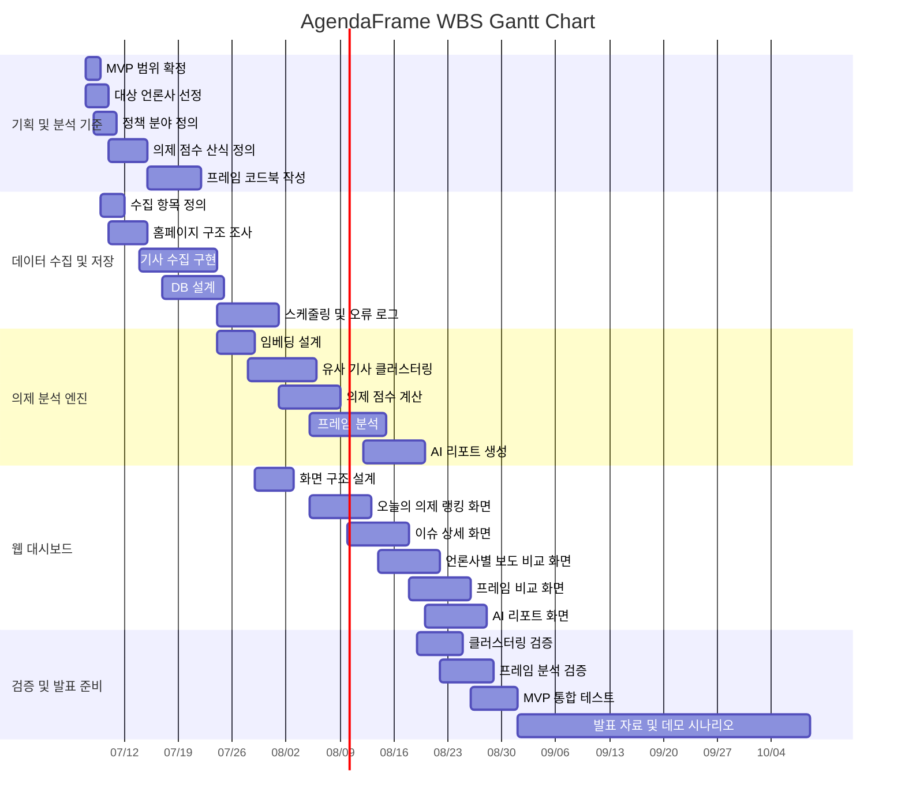

# 10. AgendaFrame WBS 및 간트차트

작성일: 2026-07-07  
작성 담당: 강준혁  
프로젝트명: AgendaFrame

## 1. 프로젝트 개요

AgendaFrame은 주요 언론사의 홈페이지 배치와 보도 빈도를 기반으로 오늘의 공적 의제를 산출하고, 동일 이슈에 대한 언론사별 관점/프레임 차이를 비교하는 AI 기반 뉴스 의제·프레임 분석 플랫폼이다.

## 2. WBS

| WBS ID | 상위 작업 | 세부 작업 | 담당자 | 산출물 | 시작일 | 종료일 | 기간 | 선행 작업 |
| --- | --- | --- | --- | --- | --- | --- | --- | --- |
| 1.0 | 기획 및 분석 기준 설계 | 프로젝트 범위 및 MVP 기능 확정 | 강준혁, 최지우 | MVP 범위 정의서 | 2026-07-07 | 2026-07-08 | 2일 | - |
| 1.1 | 기획 및 분석 기준 설계 | 분석 대상 언론사 3~5개 선정 | 강준혁 | 대상 언론사 목록 | 2026-07-07 | 2026-07-09 | 3일 | 1.0 |
| 1.2 | 기획 및 분석 기준 설계 | 정책 분야 카테고리 정의 | 최지우 | 정책 분야 기준표 | 2026-07-08 | 2026-07-10 | 3일 | 1.0 |
| 1.3 | 기획 및 분석 기준 설계 | 의제 중요도 점수 산식 정의 | 최지우 | 의제 점수 산식표 | 2026-07-10 | 2026-07-14 | 5일 | 1.1 |
| 1.4 | 기획 및 분석 기준 설계 | 프레임 코드북 작성 | 최지우 | 프레임 코드북 | 2026-07-15 | 2026-07-21 | 7일 | 1.2 |
| 2.0 | 데이터 수집 및 저장 | 기사 수집 항목 정의 | 강준혁 | 수집 항목 명세서 | 2026-07-09 | 2026-07-11 | 3일 | 1.1 |
| 2.1 | 데이터 수집 및 저장 | 언론사 홈페이지 구조 조사 | 강준혁 | 언론사별 구조 분석표 | 2026-07-10 | 2026-07-14 | 5일 | 2.0 |
| 2.2 | 데이터 수집 및 저장 | Playwright 기반 기사 수집 구현 | 강준혁 | 기사 수집 코드 | 2026-07-14 | 2026-07-23 | 10일 | 2.1 |
| 2.3 | 데이터 수집 및 저장 | 기사 메타데이터 DB 설계 | 강준혁 | 기사/언론사/수집로그 테이블 | 2026-07-17 | 2026-07-24 | 8일 | 2.0 |
| 2.4 | 데이터 수집 및 저장 | 수집 스케줄링 및 오류 로그 구현 | 강준혁 | 수집 로그 및 스케줄러 | 2026-07-24 | 2026-07-31 | 8일 | 2.2, 2.3 |
| 3.0 | 의제 분석 엔진 | 기사 임베딩 생성 방식 설계 | 강준혁 | 임베딩 설계안 | 2026-07-24 | 2026-07-28 | 5일 | 2.3 |
| 3.1 | 의제 분석 엔진 | 유사 기사 클러스터링 구현 | 강준혁 | 이슈 클러스터링 모듈 | 2026-07-28 | 2026-08-05 | 9일 | 3.0 |
| 3.2 | 의제 분석 엔진 | 의제 점수 계산 로직 구현 | 강준혁 | 의제 점수 계산 모듈 | 2026-08-01 | 2026-08-08 | 8일 | 1.3, 2.3 |
| 3.3 | 의제 분석 엔진 | Gemini 기반 프레임 분석 구현 | 강준혁, 최지우 | 프레임 분석 결과 | 2026-08-05 | 2026-08-14 | 10일 | 1.4, 3.1 |
| 3.4 | 의제 분석 엔진 | AI 리포트 생성 로직 구현 | 강준혁, 최지우 | 이슈별 AI 리포트 | 2026-08-12 | 2026-08-19 | 8일 | 3.3 |
| 4.0 | 웹 대시보드 구현 | 대시보드 화면 구조 설계 | 최지우 | 화면 와이어프레임 | 2026-07-29 | 2026-08-02 | 5일 | 1.0 |
| 4.1 | 웹 대시보드 구현 | 오늘의 의제 랭킹 화면 구현 | 강준혁 | 의제 랭킹 화면 | 2026-08-05 | 2026-08-12 | 8일 | 3.2, 4.0 |
| 4.2 | 웹 대시보드 구현 | 이슈 상세 및 기사 목록 화면 구현 | 강준혁 | 이슈 상세 화면 | 2026-08-10 | 2026-08-17 | 8일 | 3.1, 4.0 |
| 4.3 | 웹 대시보드 구현 | 언론사별 보도 비교 화면 구현 | 강준혁 | 보도 비교 화면 | 2026-08-14 | 2026-08-21 | 8일 | 4.2 |
| 4.4 | 웹 대시보드 구현 | 프레임 비교 그래프 및 근거 표시 구현 | 강준혁 | 프레임 비교 화면 | 2026-08-18 | 2026-08-25 | 8일 | 3.3, 4.3 |
| 4.5 | 웹 대시보드 구현 | AI 리포트 화면 구현 | 강준혁 | AI 리포트 화면 | 2026-08-20 | 2026-08-27 | 8일 | 3.4 |
| 5.0 | 검증 및 발표 준비 | 클러스터링 결과 샘플 검증 | 최지우 | 클러스터링 검증표 | 2026-08-19 | 2026-08-24 | 6일 | 3.1 |
| 5.1 | 검증 및 발표 준비 | 프레임 분석 결과 수동 검토 | 최지우 | 프레임 검증표 | 2026-08-22 | 2026-08-28 | 7일 | 3.3 |
| 5.2 | 검증 및 발표 준비 | MVP 통합 테스트 및 오류 수정 | 강준혁 | 통합 테스트 결과 | 2026-08-26 | 2026-08-31 | 6일 | 4.1, 4.2, 4.3, 4.4, 4.5 |
| 5.3 | 검증 및 발표 준비 | 발표 자료 및 데모 시나리오 작성 | 강준혁, 최지우 | 발표 자료, 데모 시나리오 | 2026-09-01 | 2026-10-08 | 38일 | 5.2 |

## 3. 간트차트 표

| 작업 | 7/7~7/13 | 7/14~7/20 | 7/21~7/27 | 7/28~8/3 | 8/4~8/10 | 8/11~8/17 | 8/18~8/24 | 8/25~8/31 | 9/1~10/8 |
| --- | --- | --- | --- | --- | --- | --- | --- | --- | --- |
| 프로젝트 범위 및 MVP 확정 | X |  |  |  |  |  |  |  |  |
| 대상 언론사 및 정책 분야 정의 | X |  |  |  |  |  |  |  |  |
| 의제 점수 산식 정의 | X | X |  |  |  |  |  |  |  |
| 프레임 코드북 작성 |  | X | X |  |  |  |  |  |  |
| 기사 수집 항목 및 홈페이지 구조 조사 | X | X |  |  |  |  |  |  |  |
| 기사 자동 수집 구현 |  | X | X |  |  |  |  |  |  |
| DB 설계 및 수집 로그 구현 |  | X | X | X |  |  |  |  |  |
| 유사 기사 클러스터링 |  |  |  | X | X |  |  |  |  |
| 의제 점수 계산 로직 |  |  |  | X | X |  |  |  |  |
| 프레임 분석 구현 |  |  |  |  | X | X |  |  |  |
| AI 리포트 생성 |  |  |  |  |  | X | X |  |  |
| 대시보드 화면 설계 |  |  |  | X |  |  |  |  |  |
| 오늘의 의제 랭킹 화면 |  |  |  |  | X | X |  |  |  |
| 이슈 상세 및 기사 목록 화면 |  |  |  |  | X | X |  |  |  |
| 언론사별 보도 비교 화면 |  |  |  |  |  | X | X |  |  |
| 프레임 비교 및 근거 표시 화면 |  |  |  |  |  |  | X | X |  |
| AI 리포트 화면 |  |  |  |  |  |  | X | X |  |
| 클러스터링·프레임 분석 검증 |  |  |  |  |  |  | X | X |  |
| MVP 통합 테스트 및 오류 수정 |  |  |  |  |  |  |  | X |  |
| 발표 자료 및 데모 시나리오 작성 |  |  |  |  |  |  |  |  | X |

## 4. Mermaid 간트차트

