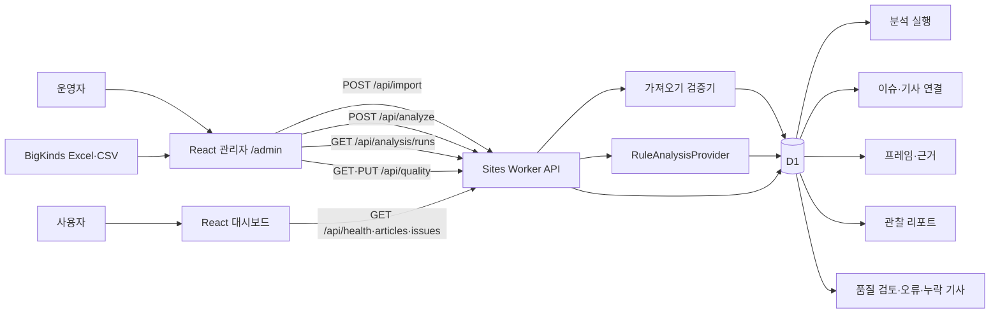
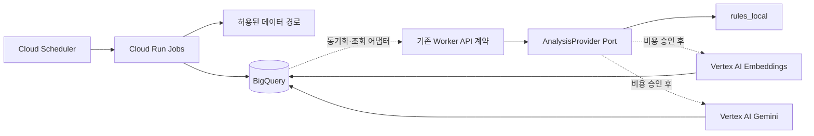
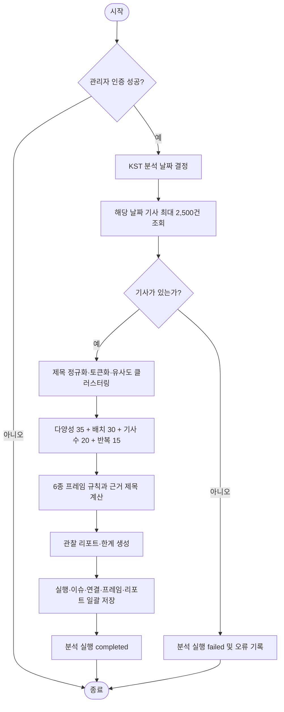
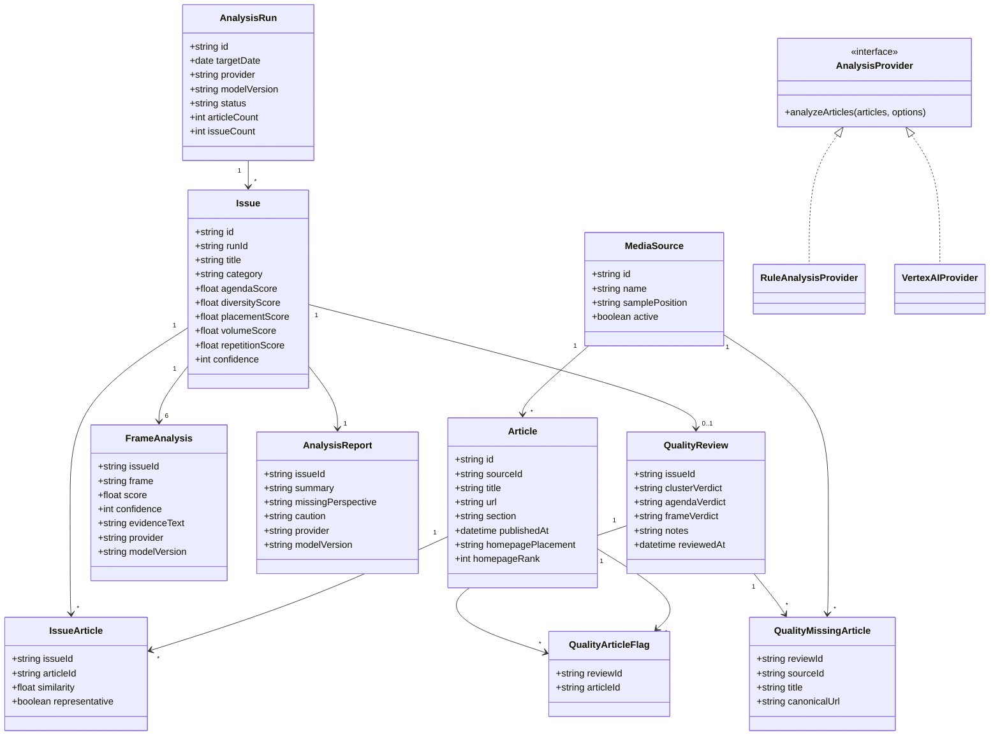
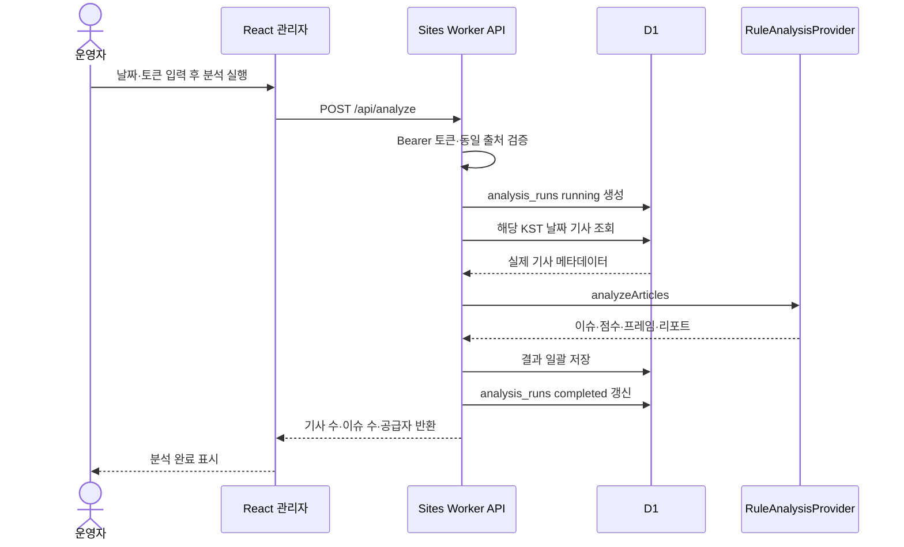
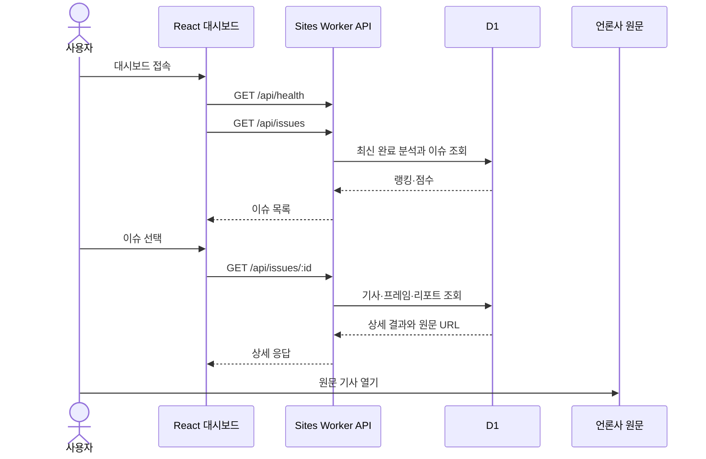
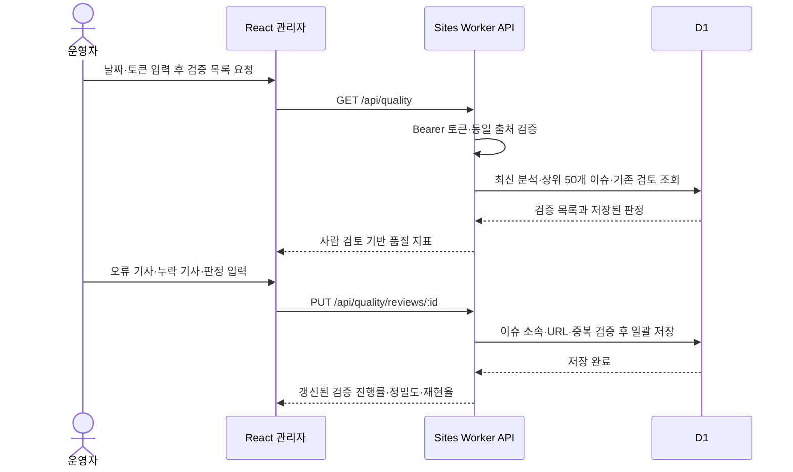

# 11. AgendaFrame UML 산출물

작성일: 2026-07-07  
최종 구현 반영: 2026-07-15
작성 담당: 강준혁  
프로젝트명: AgendaFrame

## 1. 시스템 범위와 구현 단계

AgendaFrame은 BigKinds에서 확보한 5개 언론사의 기사 메타데이터를 저장하고, 같은 의제의 기사를 이슈로 묶어 의제 점수와 제목 기반 보도 프레임을 계산한 뒤 React 대시보드로 제공한다. 기사 본문은 저장하거나 재배포하지 않는다.

현재 운영 버전과 비용 발생 후 연결할 Google Cloud 목표 버전을 구분한다.

| 구분 | 현재 운영 버전 | 향후 Google Cloud 확장 |
| --- | --- | --- |
| 수집 | 관리자 BigKinds Excel·CSV 가져오기 | Cloud Scheduler·Cloud Run Jobs 수집 자동화 |
| 저장 | Sites D1 | BigQuery 분석 저장소 추가 |
| 이슈 묶기 | 제목 토큰 유사도 규칙 | Vertex AI Embeddings 공급자 추가 |
| 프레임·리포트 | `rules_local` 규칙 분석 | Vertex AI Gemini 공급자 추가 |
| 웹·API | Next.js·React·TypeScript·Sites Worker | 현재 API 계약 유지 |

향후 서비스는 현재 분석기 인터페이스의 구현체를 교체하는 방식이다. 따라서 사용자 화면, `Issue`·`FrameAnalysis`·`AnalysisReport` 저장 구조, `/api/issues` 계약은 그대로 확장할 수 있다.

## 2. 액터

| 액터 | 설명 |
| --- | --- |
| 일반 사용자 | 오늘의 의제, 점수 근거, 프레임, 실제 원문 링크를 조회한다. |
| 기자·연구자 | 매체별 보도량과 표현 차이를 비교하고 원문을 검토한다. |
| 운영자 | 기사 파일을 가져오고 분석 날짜를 선택해 실행하며 분석 품질을 사람 검토한다. |
| BigKinds | 운영자가 기사 메타데이터를 확보하는 외부 뉴스 데이터 경로다. |
| RuleAnalysisProvider | 현재 비용 없이 이슈·점수·프레임·리포트를 생성한다. |
| VertexAIProvider | 향후 Embeddings·Gemini로 같은 분석 계약을 구현한다. |

## 3. 주요 유스케이스

### UC-01 실제 기사 가져오기

| 항목 | 내용 |
| --- | --- |
| 주요 액터 | 운영자, BigKinds |
| 사전 조건 | 운영자가 유효한 `IMPORT_TOKEN`과 BigKinds Excel·CSV를 보유한다. |
| 기본 흐름 | 파일 선택 → 헤더·언론사·HTTPS URL·시각 검증 → 본문 열 제거 → 500건 단위 저장 → URL 중복 결과 표시 |
| 대안 흐름 | 검증 실패 행이 있으면 서버 전송 전에 행 번호와 이유를 표시한다. |
| 사후 조건 | 실제 기사 메타데이터와 수집 실행 기록이 D1에 저장된다. |

### UC-02 일일 분석 실행

| 항목 | 내용 |
| --- | --- |
| 주요 액터 | 운영자, AnalysisProvider |
| 사전 조건 | 선택 날짜에 저장된 기사가 있고 운영자가 인증되었다. |
| 기본 흐름 | KST 날짜 선택 → 분석 실행 생성 → 기사 조회 → 이슈 클러스터링 → 의제 점수 계산 → 6종 프레임·리포트 생성 → 결과 저장 |
| 대안 흐름 | 기사 없음 또는 처리 오류 시 실패 상태와 오류를 기록한다. |
| 사후 조건 | 완료된 최신 분석 실행이 공개 API에서 조회된다. |

### UC-03 오늘의 의제 조회

| 항목 | 내용 |
| --- | --- |
| 주요 액터 | 일반 사용자, 기자·연구자 |
| 기본 흐름 | 대시보드 접속 → 최신 완료 분석 조회 → 의제 점수순 표시 → 분야 필터 선택 |
| 대안 흐름 | 완료 분석이 없으면 실제 기사 목록은 유지하고 분석 대기 상태를 표시한다. |

### UC-04 이슈 상세·원문 조회

| 항목 | 내용 |
| --- | --- |
| 주요 액터 | 일반 사용자, 기자·연구자 |
| 기본 흐름 | 이슈 선택 → 4개 점수 구성 확인 → 언론사별 기사 수·배치 확인 → 프레임 근거 확인 → 리포트 확인 → 언론사 원문 이동 |
| 주의 | 규칙 분석은 언론사의 성향이나 보도의 옳고 그름을 판정하지 않는다. |

### UC-05 실제 기사 검색

| 항목 | 내용 |
| --- | --- |
| 주요 액터 | 일반 사용자, 기자·연구자 |
| 기본 흐름 | 검색어·언론사·분야·날짜 선택 → 서버 필터 → 50건 단위 페이지네이션 → 실제 원문 이동 |

### UC-06 분석 품질 검증

| 항목 | 내용 |
| --- | --- |
| 주요 액터 | 운영자 |
| 사전 조건 | 완료된 일일 분석과 유효한 `IMPORT_TOKEN`이 있다. |
| 기본 흐름 | 상위 50개 검증 목록 조회 → 이슈 선택 → 잘못 묶인 기사 표시 → 누락 원문 등록 → 기사 묶음·의제 점수·프레임 판정 → 검토 저장 → 품질 지표 재계산 |
| 대안 흐름 | 다른 이슈의 기사, 중복 누락 URL, 공식 도메인이 아닌 URL, 허용 범위를 벗어난 입력은 저장하지 않는다. |
| 사후 조건 | 이슈별 검토·오류 기사·누락 기사와 검토 시각이 D1에 저장되고 사람 검토 기반 추정 지표가 갱신된다. |

### UC-07 기간 일괄 분석

| 항목 | 내용 |
| --- | --- |
| 주요 액터 | 운영자 |
| 사전 조건 | 최대 7일의 시작일·종료일과 유효한 `IMPORT_TOKEN`이 있다. |
| 기본 흐름 | 기간 상태 조회 → 날짜별 기사 유무 확인 → 완료 날짜 건너뛰기 → 미완료·실패 날짜 순차 분석 → 날짜별 완료·실패 상태 표시 |
| 대안 흐름 | 기사 없는 날짜는 건너뛰며 브라우저가 중단되어도 다시 실행하면 최신 성공 상태를 기준으로 이어서 처리한다. |
| 사후 조건 | 각 날짜의 `AnalysisRun`과 이슈·프레임·리포트가 독립적으로 저장된다. |

## 4. 현재 운영 컴포넌트 다이어그램

## 5. 향후 Google Cloud 어댑터 다이어그램

Google 기술은 현재 사용 중이라고 과장하지 않고, 비용 승인 후 연결할 교체 가능한 확장 계층으로 정의한다.

## 6. 분석 액티비티 다이어그램

## 7. 데이터 클래스 다이어그램

## 8. 시퀀스 다이어그램

### 8.1 관리자 분석 실행

### 8.2 사용자 이슈 조회

### 8.3 운영자 품질 검증

## 9. 구현 정합성

| UML 요소 | 구현 위치 |
| --- | --- |
| React 대시보드 | `site/app/agenda-dashboard.tsx` |
| 관리자 가져오기·분석 | `site/app/admin/admin-client.tsx` |
| 관리자 품질 검증 | `site/app/admin/quality-review.tsx` |
| 공개·관리 API | `site/worker/runtime.mjs` |
| 분석 공급자 포트 | `site/worker/analysis-provider.mjs` |
| 무료 분석 구현 | `site/worker/analysis.mjs` |
| D1 엔터티 | `site/db/schema.ts` |
| 실제 마이그레이션 | `site/drizzle/0000_*.sql`, `0001_*.sql`, `0002_*.sql` |
| Sites Worker 진입점 | `site/worker/index.ts` |

현재 UML은 실제 구현과 일치하며, 점선으로 표시한 Google Cloud 구성만 비용 승인 후의 확장 목표다.
