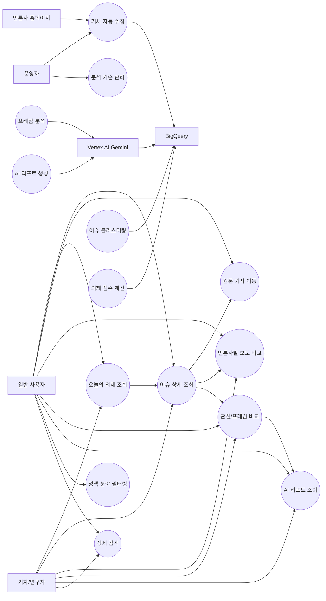
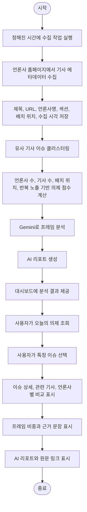
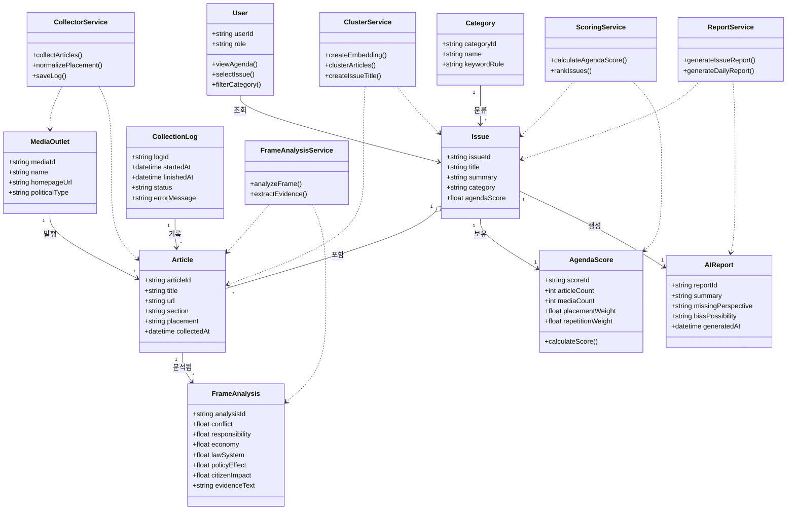
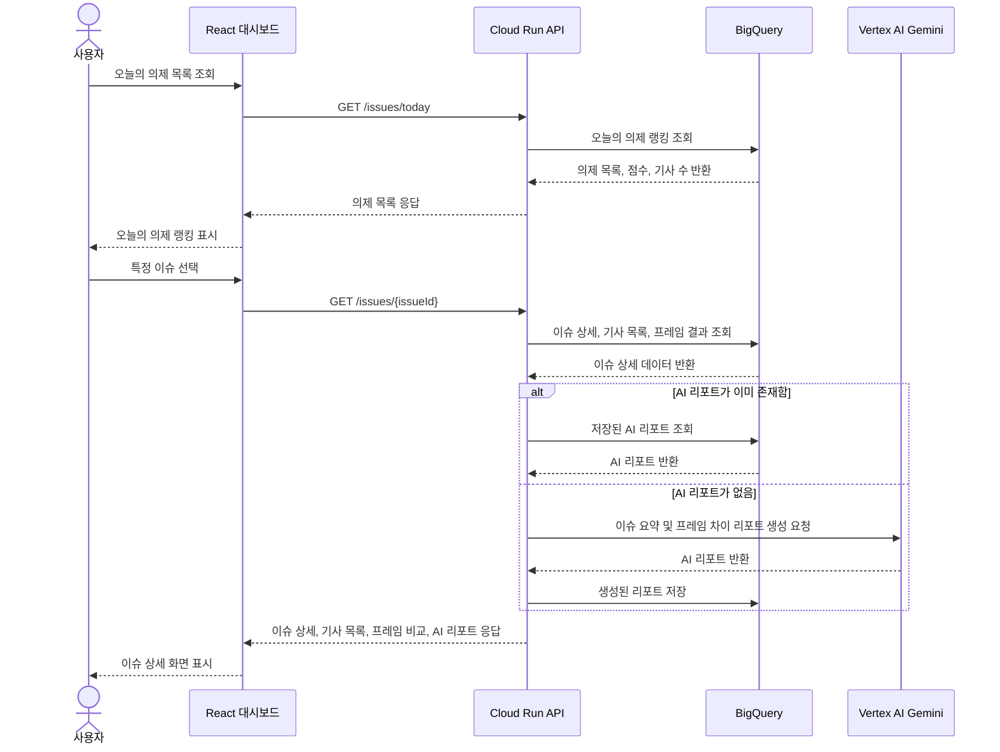
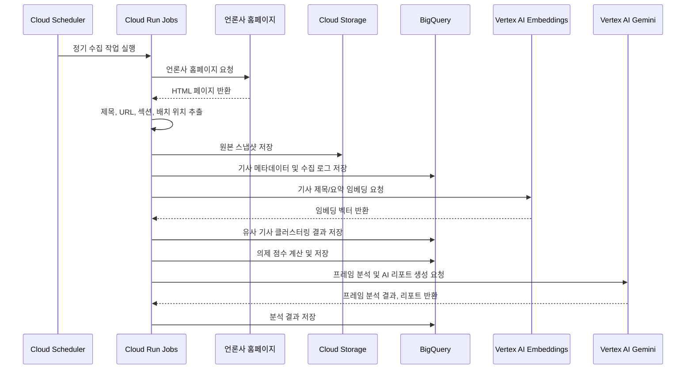

# 11. AgendaFrame UML 산출물

작성일: 2026-07-07  
작성 담당: 강준혁  
프로젝트명: AgendaFrame

## 1. 시스템 범위

AgendaFrame은 주요 언론사 홈페이지에서 기사 메타데이터를 수집하고, 유사 기사들을 이슈 단위로 묶은 뒤, 의제 중요도와 언론사별 프레임 차이를 분석해 웹 대시보드로 제공하는 시스템이다.

## 2. 액터 정의

| 액터 | 설명 |
| --- | --- |
| 일반 사용자 | 오늘의 주요 의제, 이슈 상세, 언론사별 보도 차이, AI 리포트를 조회하는 사용자 |
| 기자/연구자 | 특정 이슈의 보도 경향과 프레임 차이를 분석 자료로 활용하는 사용자 |
| 운영자 | 분석 대상 언론사, 정책 분야, 프레임 기준, 수집 상태를 관리하는 사용자 |
| 언론사 홈페이지 | 기사 제목, URL, 섹션, 배치 위치 등의 원천 데이터를 제공하는 외부 웹사이트 |
| Vertex AI Gemini | 기사 프레임 분석과 AI 리포트 생성을 수행하는 외부 AI 서비스 |
| BigQuery | 기사 메타데이터, 이슈, 프레임 분석 결과, 의제 점수를 저장하는 분석 DB |

## 3. 유스케이스 명세서

### UC-01 오늘의 의제 조회

| 항목 | 내용 |
| --- | --- |
| 유스케이스명 | 오늘의 의제 조회 |
| 주요 액터 | 일반 사용자, 기자/연구자 |
| 목적 | 사용자가 오늘 주요 언론사에서 중요하게 다룬 공적 의제를 순위로 확인한다. |
| 사전 조건 | 기사 수집, 이슈 클러스터링, 의제 점수 계산이 완료되어 있다. |
| 기본 흐름 | 1. 사용자가 대시보드에 접속한다. 2. 시스템이 오늘의 의제 목록을 조회한다. 3. 시스템이 의제명, 중요도 점수, 관련 언론사 수, 관련 기사 수를 표시한다. 4. 사용자는 관심 있는 의제를 선택한다. |
| 대안 흐름 | 수집된 기사가 없으면 시스템은 "아직 분석된 의제가 없습니다"라는 안내를 표시한다. |
| 사후 조건 | 사용자는 이슈 상세 화면으로 이동할 수 있다. |
| 중요도 | 상 |

### UC-02 이슈 상세 조회

| 항목 | 내용 |
| --- | --- |
| 유스케이스명 | 이슈 상세 조회 |
| 주요 액터 | 일반 사용자, 기자/연구자 |
| 목적 | 사용자가 특정 의제에 포함된 기사 목록과 이슈 요약을 확인한다. |
| 사전 조건 | 사용자가 오늘의 의제 목록에서 특정 이슈를 선택한다. |
| 기본 흐름 | 1. 시스템이 선택된 이슈 ID를 기준으로 상세 정보를 조회한다. 2. 시스템이 이슈 제목과 요약 설명을 표시한다. 3. 시스템이 관련 기사 목록을 제목, 언론사명, 수집 시각, 원문 링크와 함께 표시한다. 4. 사용자는 기사 목록을 최신순 또는 언론사순으로 정렬한다. |
| 대안 흐름 | 관련 기사 URL이 유효하지 않으면 시스템은 원문 이동 불가 상태를 표시한다. |
| 사후 조건 | 사용자는 원문 기사 페이지로 이동하거나 언론사별 비교 정보를 확인할 수 있다. |
| 중요도 | 상 |

### UC-03 언론사별 보도 비교

| 항목 | 내용 |
| --- | --- |
| 유스케이스명 | 언론사별 보도 비교 |
| 주요 액터 | 일반 사용자, 기자/연구자 |
| 목적 | 같은 이슈를 언론사별로 얼마나, 어떤 제목과 배치로 보도했는지 비교한다. |
| 사전 조건 | 선택된 이슈에 여러 언론사의 관련 기사가 존재한다. |
| 기본 흐름 | 1. 사용자가 이슈 상세 화면에서 보도 비교 영역을 확인한다. 2. 시스템이 언론사별 기사 수를 집계한다. 3. 시스템이 언론사별 홈페이지 배치 위치를 표시한다. 4. 시스템이 언론사별 제목을 나란히 보여준다. 5. 시스템이 제목 속 강조 단어를 표시한다. |
| 대안 흐름 | 특정 언론사의 기사가 없으면 "해당 언론사 보도 없음"으로 표시한다. |
| 사후 조건 | 사용자는 언론사별 보도 빈도와 편집상 중요도 차이를 비교할 수 있다. |
| 중요도 | 상 |

### UC-04 관점/프레임 비교

| 항목 | 내용 |
| --- | --- |
| 유스케이스명 | 관점/프레임 비교 |
| 주요 액터 | 일반 사용자, 기자/연구자 |
| 목적 | 사용자가 같은 이슈에 대해 언론사별로 어떤 관점이 강조되었는지 확인한다. |
| 사전 조건 | Gemini 기반 프레임 분석 결과가 저장되어 있다. |
| 기본 흐름 | 1. 사용자가 프레임 비교 영역을 확인한다. 2. 시스템이 갈등, 책임, 경제, 법·제도, 정책효과, 시민영향 프레임 비중을 계산한다. 3. 시스템이 언론사별 프레임 비중 그래프를 표시한다. 4. 사용자는 특정 프레임을 선택한다. 5. 시스템이 해당 프레임으로 분류된 근거 문장 또는 제목 표현을 표시한다. |
| 대안 흐름 | AI 분석 신뢰도가 낮으면 시스템은 "검토 필요" 상태를 표시한다. |
| 사후 조건 | 사용자는 이슈의 관점 차이를 근거와 함께 이해할 수 있다. |
| 중요도 | 상 |

### UC-05 AI 리포트 조회

| 항목 | 내용 |
| --- | --- |
| 유스케이스명 | AI 리포트 조회 |
| 주요 액터 | 일반 사용자, 기자/연구자 |
| 목적 | 사용자가 특정 이슈에 대한 AI 요약 리포트를 읽고 관점 차이를 빠르게 파악한다. |
| 사전 조건 | 이슈별 기사 목록과 프레임 분석 결과가 존재한다. |
| 기본 흐름 | 1. 사용자가 AI 리포트 영역을 연다. 2. 시스템이 주요 관점 요약을 표시한다. 3. 시스템이 상대적으로 적게 다뤄진 관점을 안내한다. 4. 시스템이 치우침 가능성을 관찰형 문장으로 표시한다. 5. 시스템이 리포트 근거가 되는 원문 링크를 함께 제공한다. |
| 대안 흐름 | 분석 가능한 기사 수가 부족하면 시스템은 리포트 생성을 보류한다. |
| 사후 조건 | 사용자는 이슈를 다양한 관점에서 이해하고 원문으로 확인할 수 있다. |
| 중요도 | 상 |

### UC-06 정책 분야 필터링

| 항목 | 내용 |
| --- | --- |
| 유스케이스명 | 정책 분야 필터링 |
| 주요 액터 | 일반 사용자, 기자/연구자 |
| 목적 | 사용자가 정치, 경제, 사회, 외교안보, 노동, 복지, 산업정책 등 특정 분야의 의제만 확인한다. |
| 사전 조건 | 각 이슈에 정책 분야 태그가 부여되어 있다. |
| 기본 흐름 | 1. 사용자가 정책 분야 탭을 선택한다. 2. 시스템이 선택된 분야에 해당하는 이슈만 필터링한다. 3. 시스템이 필터링된 의제 목록을 중요도 순으로 표시한다. |
| 대안 흐름 | 해당 분야 이슈가 없으면 시스템은 빈 상태 안내 문구를 표시한다. |
| 사후 조건 | 사용자는 관심 정책 분야의 주요 의제를 확인할 수 있다. |
| 중요도 | 중 |

### UC-07 기사 자동 수집 및 분석

| 항목 | 내용 |
| --- | --- |
| 유스케이스명 | 기사 자동 수집 및 분석 |
| 주요 액터 | 운영자, 언론사 홈페이지, BigQuery, Vertex AI Gemini |
| 목적 | 시스템이 정해진 주기마다 기사 메타데이터를 수집하고 분석 결과를 생성한다. |
| 사전 조건 | 분석 대상 언론사와 수집 주기가 설정되어 있다. |
| 기본 흐름 | 1. 스케줄러가 수집 작업을 실행한다. 2. 시스템이 언론사 홈페이지에서 기사 메타데이터를 수집한다. 3. 시스템이 기사 메타데이터를 BigQuery에 저장한다. 4. 시스템이 유사 기사들을 이슈 단위로 묶는다. 5. 시스템이 의제 점수를 계산한다. 6. 시스템이 Gemini로 프레임 분석과 AI 리포트를 생성한다. 7. 시스템이 결과를 대시보드에서 조회 가능한 상태로 저장한다. |
| 대안 흐름 | 특정 언론사 수집이 실패하면 오류 로그를 저장하고 다음 언론사 수집을 계속한다. |
| 사후 조건 | 사용자는 최신 의제와 분석 결과를 조회할 수 있다. |
| 중요도 | 상 |

## 4. 유스케이스 다이어그램

## 5. 액티비티 다이어그램

## 6. 클래스 다이어그램

## 7. 시퀀스 다이어그램

### 7.1 이슈 상세 및 AI 리포트 조회 시퀀스

### 7.2 기사 자동 수집 및 분석 시퀀스

## 8. UML 산출물 요약

| 산출물 | 포함 내용 | 활용 목적 |
| --- | --- | --- |
| 유스케이스 명세서 | 주요 기능별 액터, 목적, 흐름, 대안 흐름, 사후 조건 | 요구사항 구체화 |
| 유스케이스 다이어그램 | 사용자, 운영자, 외부 서비스와 주요 기능 관계 | 시스템 범위 설명 |
| 액티비티 다이어그램 | 기사 수집부터 사용자 조회까지의 전체 활동 흐름 | 처리 절차 설명 |
| 클래스 다이어그램 | 사용자, 기사, 이슈, 프레임 분석, AI 리포트, 서비스 클래스 관계 | 데이터 구조 및 객체 관계 설명 |
| 시퀀스 다이어그램 | 이슈 상세 조회 및 자동 수집·분석 시나리오의 메시지 흐름 | 기능 수행 순서 설명 |

