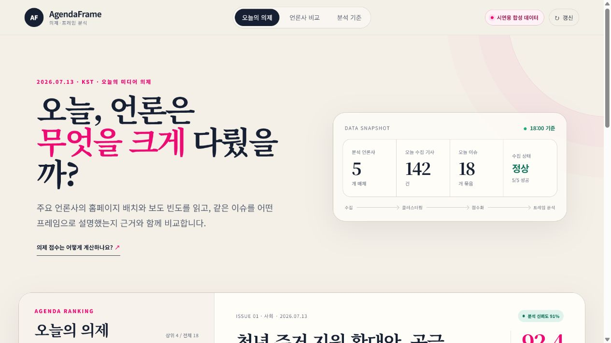

# AgendaFrame

주요 언론사의 홈페이지 배치와 보도 빈도를 바탕으로 오늘의 공적 의제를 정리하고, 같은 이슈를 언론사가 어떤 프레임으로 설명하는지 근거와 함께 비교하는 AI 기반 뉴스 분석 플랫폼입니다.

[공개 데모 보기](https://agendaframe-capstone.kjh01072299206.chatgpt.site) · [MVP 실행 안내](site/README.md) · [협업 규칙](CONTRIBUTING.md)



> 현재 공개 데모는 제품 흐름을 검증하기 위한 **합성 데이터**를 사용합니다. 화면의 기사, 언론사 이름, 점수와 분석 결과는 실제 보도 평가가 아닙니다.

## 문제와 접근

뉴스의 중요도는 기사 수뿐 아니라 홈페이지의 편집 위치, 반복 노출, 여러 매체의 동시 보도 여부에도 드러납니다. AgendaFrame은 이 신호를 의제 점수로 정리하고, 동일 이슈 안에서 제목 표현과 강조점이 어떻게 달라지는지 비교합니다. 결과만 제시하지 않고 점수 구성 요소와 프레임 근거를 함께 보여주는 것이 핵심입니다.

## MVP 기능

- 오늘의 의제 랭킹과 정책 분야 필터
- 언론사 다양성·배치·기사 수·반복 노출 기반 의제 점수
- 언론사별 기사 수, 홈페이지 배치, 제목 표현 비교
- 갈등·책임·경제·법·제도·정책효과·시민영향 프레임 분석
- 근거 표현과 신뢰도를 포함한 관찰형 AI 리포트
- 관련 기사 정렬 및 상세 정보
- 반응형 UI, 키보드 접근성, 동작 줄이기 지원
- 배포 상태 확인을 위한 `/api/health` 엔드포인트

## 기술 구성

| 영역 | 구성 |
| --- | --- |
| UI | Next.js 16, React 19, TypeScript |
| 빌드 | Vite, vinext |
| 배포 | OpenAI Sites, Cloudflare Workers 호환 ESM |
| 데이터 계층 | Drizzle ORM, D1 확장 구조 |
| 검증 | Node.js test runner, GitHub Actions |

## 빠른 시작

Node.js 22.13 이상이 필요합니다.

```bash
cd site
npm ci
npm run dev
```

검증 명령은 다음과 같습니다.

```bash
cd site
npm test
npm run lint
```

## 저장소 구조

```text
.
├── site/                       # 배포 가능한 AgendaFrame MVP
│   ├── app/                    # 화면과 메타데이터
│   ├── public/                 # 클라이언트 스크립트와 정적 자산
│   ├── db/                     # 데이터베이스 스키마
│   ├── worker/                 # Workers 진입점
│   └── tests/                  # MVP 검증 테스트
├── outputs/                    # 대시보드·WBS·UML 이미지
├── tools/                      # 산출물 렌더링 도구
├── AgendaFrame_*.md            # 백로그, WBS, UML, 연구 문서
├── AgendaFrame_기능명세서.xlsx
├── CONTRIBUTING.md
└── README.md
```

## 주요 산출물

- [프로덕트 백로그](AgendaFrame_프로덕트백로그.md)
- [스프린트 백로그](AgendaFrame_스프린트백로그.md)
- [WBS·간트차트](AgendaFrame_10_WBS_간트차트.md)
- [UML 설계](AgendaFrame_11_UML.md)
- [선행연구 및 선행서비스 검토](AgendaFrame_선행연구_및_선행서비스_검토.md)
- [개발 산출물 제작 워크플로우](AgendaFrame_개발산출물_제작툴_워크플로우.md)
- [기능명세서](AgendaFrame_기능명세서.xlsx)

이미지 산출물은 `outputs/`에서 확인할 수 있으며 다음 명령으로 다시 생성할 수 있습니다.

```powershell
python tools/render_agendaframe_outputs.py
```

## 데이터·보안 원칙

- API 키, 비밀번호, 서비스 계정, `.env` 파일을 커밋하지 않습니다.
- 신청서, 지원비 서식, 개인정보가 포함된 문서는 공개 저장소에 올리지 않습니다.
- 저작권 확인 없이 기사 원문 전체나 외부 이미지를 재배포하지 않습니다.
- 실제 데이터 연결 전까지 합성 데이터 표시를 제거하지 않습니다.
- 런타임 비밀값은 배포 환경에서 관리하고 소스 코드에 저장하지 않습니다.

## 협업과 이용 조건

브랜치, 커밋, PR과 리뷰 규칙은 [CONTRIBUTING.md](CONTRIBUTING.md)를 따릅니다. 이 저장소에는 현재 별도의 오픈소스 라이선스가 부여되어 있지 않으므로, 별도 허가 없는 코드와 문서의 재사용은 허용되지 않습니다.
