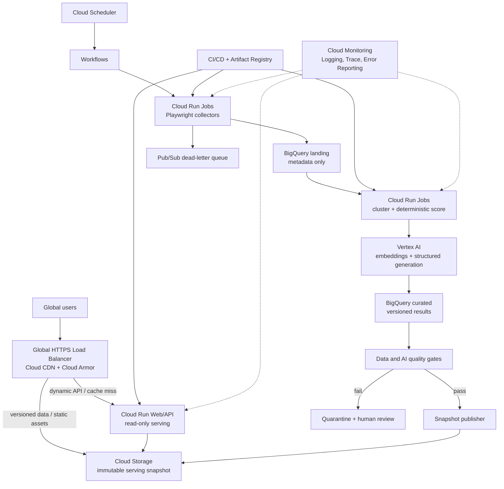

# AgendaFrame Cloud Runtime Architecture

- 상태: **목표 설계(as-planned)** — 아래 0장의 구분표를 먼저 읽을 것
- 최초 작성: 2026-07-17 · 이행 현황 갱신: 2026-08-06
- 대상: 공개 데모, Google Cloud 라이브 서비스, 수집·분석 파이프라인

## 0. 이 문서와 실제 시스템의 관계

이 문서는 2026-07-17에 쓴 **목표 설계**다. 1장부터는 그때의 설계안을 그대로 둔다.
실제로 무엇이 서 있는지는 이 표가 기준이다.

| 구성요소 | 상태 | 근거 |
| --- | --- | --- |
| Vertex AI (Gemini) 분석 호출 | **가동** | 상위 5개 의제 클러스터링을 `gemini-2.5-flash-lite`로 산출 |
| BigQuery 데이터셋·분석 상태 원장 | **코드·프로비저닝 스크립트 있음** | `src/backend/gcp_store.py`, `scripts/gcp/provision.ps1` |
| Cloud Storage 비공개 버킷(수명주기 포함) | **프로비저닝 스크립트 있음** | `scripts/gcp/provision.ps1` |
| Cloud Run Job (설정 점검·파일럿) | **배포 스크립트 있음** | `scripts/gcp/deploy.ps1`, `deploy-trial-jobs.ps1` |
| Artifact Registry · 예산 상한 | **적용** | 단일 프로젝트에 월 지출 상한 설정 |
| 공개 서빙 (Cloud Run + LB + CDN + Armor) | **미구현 — 대체됨** | 서빙은 Vercel. 4장의 `src/frontend`는 현재 `site/`다 |
| Cloud Scheduler · Workflows · Pub/Sub DLQ | **미구현 — 보류** | 상시 크롤링을 접었으므로 자동 수집 트리거가 없다 |
| Playwright 상시 크롤러 (3.2절) | **폐기** | 이용약관 검토 결과 BigKinds 가져오기로 피벗 |
| Terraform · dev/stg/prod 3분리 · OpenTelemetry · SLO 대시보드 | **미구현 — 범위 밖** | 사용자 규모가 이를 정당화하지 않는다. PowerShell 프로비저닝 스크립트로 대신한다 |
| `/api/v1/*` 경로, `AGENDAFRAME_DATA_MODE` | **미구현** | 실제 경로는 `/api/*`, 런타임 모드 스위치는 두지 않았다 |

### 실제 런타임 (as-built, 2026-08-06)

```text
사용자 → Vercel (Next.js 16 / React 19)
           ├─ 화면 + /api/initial-five/*  ← 빌드 시 포함된 정적 분석 산출물
           └─ 그 밖의 /api/*  ── rewrite ──→ Cloudflare Worker + D1
                                              (수집 가져오기, 이슈, 품질 검증)

오프라인 분석 (로컬/배치, 공개 요청 경로 밖)
   BigKinds Excel·CSV → 구조화 분석 → site/data/*.json → 빌드에 포함
   Vertex AI Gemini    → 의제 클러스터링
```

- 공개 요청은 모델을 호출하지 않는다. 분석은 전부 사전 계산해 산출물로 넣는다.
  이 점은 2장 원칙 2·6과 12장 비목표를 그대로 지킨다.
- 배포는 `main` push → Vercel 자동 빌드다. 절차와 관문은 [`../deploy.md`](../deploy.md).
- 라이브 `/api/health`는 아직 `agenda-structure-v5`를 돌려준다. 워커를 v6으로
  재배포하지 않았기 때문이며 프로덕트 백로그 PBL-29로 잡혀 있다.

## 1. 결정 요약

AgendaFrame은 **즉시 공개 가능한 데모 경로**와 **실제 뉴스 수집·Vertex AI·BigQuery를 사용하는 라이브 경로**를 물리적·논리적으로 분리한다. 두 경로는 같은 화면 모델과 API 스키마를 사용하되 데이터 출처, 배포 게이트, 권한, 비용 한도를 공유하지 않는다.

| 구분 | Demo Edge | Live GCP |
| --- | --- | --- |
| 목적 | 제품 가치와 UX를 즉시 검증 | 실제 수집·분석·운영 |
| 현재 코드와의 관계 | `site/`의 vinext 빌드를 사용(작성 당시 경로는 `src/frontend`였다) | 신규 GCP API·배치·저장소 구현 필요 |
| 데이터 | 저장소에 검토 후 포함한 고정 데모 스냅샷 | 허용된 언론사에서 수집한 최신 메타데이터 |
| AI | 검토된 사전 생성 결과만 표시 | Vertex AI를 배치 호출하고 품질 게이트 통과 후 공개 |
| BigQuery | 사용하지 않음 | 분석 원장 및 이력 저장 |
| 사용자 쓰기 | 없음 | 초기에는 운영자만; 사용자 기능은 별도 인증 후 추가 |
| 배포 상태 표시 | 화면에 `DEMO DATA`와 기준 시각을 상시 표시 | `LIVE`, 마지막 성공 수집 시각, 분석 버전을 표시 |
| 장애 시 동작 | 번들 스냅샷을 계속 제공 | 마지막 검증 스냅샷을 제공; 데모로 조용히 전환하지 않음 |

(작성 당시 기록) 현재 프론트엔드 배포는 **엣지 데모**이지 Google Cloud 라이브 파이프라인의 완료를 의미하지 않는다. 라이브라고 표시하려면 이 문서의 데이터 출처, 품질, 보안, 관측성 게이트를 모두 통과해야 한다.

2026-08-06 기준으로 서빙은 Cloudflare가 아니라 Vercel이고 D1은 실제로 붙어 있다. 다만 **품질 게이트 통과 전이라는 판단은 그대로 유효하다** — 사람 라벨 실측(PBL-25)이 아직 0건이므로 어떤 화면도 검증 완료로 표시하지 않는다.

## 2. 설계 원칙

1. **출처를 숨기지 않는다.** 데모·라이브·마지막 갱신 시각·분석 버전을 API와 UI 모두에 노출한다.
2. **분석과 서빙을 분리한다.** 공개 요청에서 BigQuery나 Vertex AI를 직접 호출하지 않는다. 검증된 읽기 전용 스냅샷을 서빙한다.
3. **기사 전문을 저장하지 않는다.** 기본 수집 범위는 제목, 원문 URL, 매체, 섹션, 홈페이지 배치, 수집 시각과 분석에 필요한 최소 메타데이터다.
4. **AI는 판단자가 아니라 보조 분석기다.** 근거 URL, 불확실성, 모델·프롬프트 버전을 남기고 낮은 신뢰도는 보류한다.
5. **배포와 공개를 분리한다.** 새 결과를 저장했다고 바로 사용자에게 보이지 않는다. 검증 후 원자적으로 공개 포인터를 바꾼다.
6. **비용 폭주를 구조적으로 막는다.** 공개 트래픽이 Vertex AI 호출량이나 BigQuery 스캔량에 비례하지 않게 한다.
7. **지역 장애보다 데이터 정합성을 우선한다.** 초기에는 서울 단일 쓰기 평면과 글로벌 캐시를 사용하고, 실제 수요가 확인된 뒤 다중 지역 쓰기를 검토한다.

## 3. 목표 아키텍처



### 3.1 글로벌 요청 경로

- 전역 외부 Application Load Balancer를 단일 공개 진입점으로 둔다.
- Cloud Armor가 관리형 WAF 규칙, IP/지역 기반 정책이 아닌 행동 기반 rate limit, 비정상 봇 차단을 담당한다.
- 정적 자산과 공개 GET 응답은 Cloud CDN에 캐시한다. 스냅샷 버전을 URL 또는 ETag에 포함해 안전하게 무효화한다.
- 초기 API는 서울(`asia-northeast3`)의 Cloud Run을 원본으로 사용한다. 전 세계 사용자는 CDN에서 대부분의 읽기를 처리한다.
- 트래픽과 규제 요구가 확인되면 도쿄 등 두 번째 승인 리전에 동일한 **읽기 전용** Cloud Run을 추가한다. 지역 선택은 배포 시점의 Cloud Run·Vertex AI 모델 가용성과 데이터 국외 이전 정책을 다시 확인한다.
- BigQuery를 사용자 요청마다 조회하지 않는다. 초기 대시보드용 집계는 Cloud Storage의 버전이 붙은 JSON snapshot과 작은 `manifest.json`으로 투영한다. 동적 검색·개인화 요구가 커질 때만 Firestore를 별도 serving store로 추가한다.

### 3.2 수집·분석 경로

1. Cloud Scheduler가 Workflows 실행을 시작하고 고유 `run_id`를 만든다.
2. Workflows는 매체별 Cloud Run Job을 실행한다. 동시성, 재시도, 도메인별 요청 간격은 매체 정책으로 제한한다.
3. 수집기는 페이지를 메모리에서 파싱하고 기사 전문이나 전체 HTML을 기본 저장하지 않는다. 원문 보관이 반드시 필요하면 법무·저작권 승인을 받은 별도 격리 버킷에만 짧은 TTL로 저장한다.
4. 신규 메타데이터는 날짜 파티션 BigQuery landing 테이블에 쓰고, 실패는 원인 코드와 함께 dead-letter topic에 보낸다.
5. 클러스터링, 의제 점수, 프레임 분석은 비동기 Job으로 수행한다. 의제 점수는 결정론적 코드와 `score_version`으로 계산한다.
6. Vertex AI 출력은 JSON Schema로 검증하고 근거 URL이 입력 집합에 존재하는지 확인한다. 임의 URL이나 근거 없는 문장은 공개하지 않는다.
7. 품질 게이트를 통과한 `analysis_version`만 immutable serving snapshot으로 만든다. publisher는 객체별 checksum과 전체 manifest 서명을 만든 뒤 `current_snapshot` 포인터를 원자적으로 교체한다.
8. 실패한 실행은 직전 정상 스냅샷을 훼손하지 않는다. 재처리는 동일 `run_id`/idempotency key로 중복 저장을 막는다.

### 3.3 저장소 책임

| 저장소 | 책임 | 금지 사항 | 기본 보존 |
| --- | --- | --- | --- |
| BigQuery landing | 수집 메타데이터, 수집 실행 이력 | 기사 전문, 사용자 비밀 | 원시 메타데이터 90일 후 정책 재검토 |
| BigQuery curated | 이슈, 점수, 프레임, 리포트의 버전 이력 | 공개 요청의 실시간 원본 조회 | 분석 재현 기간에 맞춰 1년부터 시작 |
| Cloud Storage serving | 현재 공개 가능한 immutable JSON snapshot과 manifest | 프롬프트 원문, 운영 로그, 비공개 검토 결과 | 현재본 + 최근 롤백본 |
| Cloud Storage exports | PDF, 빌드 산출물, 승인된 임시 증거 | 기본 설정에서 전체 기사 HTML | PDF 만료 24시간, 임시 객체 lifecycle 삭제 |
| Cloud Logging | 구조화 운영 로그와 감사 단서 | 기사 내용, 토큰, 이메일 원문 | 앱 로그 30일, 감사 로그는 정책별 별도 보존 |
| Secret Manager | API 비밀과 외부 연동 자격 | 소스 저장소의 `.env` | 자동 회전 가능한 비밀 90일 이내 회전 |

BigQuery는 분석 원장이지 트랜잭션 데이터베이스가 아니다. 즐겨찾기·구독·팀 워크스페이스 같은 사용자 기능이 생기면 Firestore 또는 Cloud SQL을 별도 도메인 저장소로 선택한다. 초기 공개 MVP에는 사용자 상태를 두지 않는다.

## 4. 데모와 라이브를 강제하는 코드 계약

프론트엔드가 데이터 출처에 의존하지 않도록 다음 포트를 둔다.

```ts
type RuntimeMode = "demo" | "live";

interface AgendaRepository {
  listIssues(query: IssueQuery): Promise<IssueSummary[]>;
  getIssue(id: string): Promise<IssueDetail | null>;
  getRuntimeInfo(): Promise<{
    mode: RuntimeMode;
    snapshotId: string;
    collectedAt: string;
    analyzedAt: string;
    scoreVersion: string;
    modelVersion?: string;
  }>;
}
```

- `DemoAgendaRepository`: 저장소에 포함한 검토 완료 JSON만 읽는다. 네트워크, Secret, BigQuery, Vertex AI가 필요 없어야 한다.
- `GcpAgendaRepository`: 공개 serving snapshot만 읽는다. BigQuery 원장 접근은 내부 publisher에만 허용한다.
- 런타임 모드는 서버에서 설정한 `AGENDAFRAME_DATA_MODE=demo|live`만 신뢰한다. 쿼리 파라미터나 브라우저 저장값으로 바꿀 수 없게 한다.
- `live`인데 필요한 GCP 구성이나 스냅샷 서명이 없으면 시작을 실패시킨다. 라이브 장애를 데모 데이터로 조용히 대체하지 않는다.
- 모든 API 응답은 `meta.mode`, `snapshotId`, `collectedAt`, `analysisVersion`을 포함한다. 캐시 키에도 `snapshotId`를 넣는다.
- 데모 원문 링크는 실제 기사처럼 보이게 임의 생성하지 않는다. 허가된 공개 URL 또는 명백한 예시 URL만 사용한다.

권장 API 경로는 `/api/v1/issues`, `/api/v1/issues/{id}`, `/api/v1/runtime`이다. OpenAPI/JSON Schema를 단일 원본으로 만들고 demo/live contract test를 같은 테스트 묶음으로 실행한다.

## 5. 보안과 책임 있는 수집

### 5.1 신뢰 경계

- 공개 인터넷은 Load Balancer만 접근할 수 있고 Cloud Run ingress는 Load Balancer 경유로 제한한다.
- 공개 API 서비스 계정에는 serving snapshot 읽기만 부여한다.
- crawler, analyzer, publisher, deployer를 각각 다른 서비스 계정으로 분리한다. 서비스 계정 키 파일은 만들지 않는다.
- CI는 Workload Identity Federation으로 짧은 수명의 권한을 받아 Artifact Registry와 배포 API만 사용한다.
- 운영자 엔드포인트는 별도 호스트와 IAP/조직 계정 allowlist 뒤에 둔다. 공개 API에 `/admin`을 섞지 않는다.
- Secret Manager 접근은 필요한 런타임 계정에 비밀 단위로 허용한다. 비밀 값과 Authorization 헤더는 로그에서 제거한다.
- crawler는 운영자가 승인한 URL/호스트만 요청한다. 리디렉션마다 허용 호스트를 다시 검사하고 loopback, link-local, RFC1918 및 클라우드 metadata 주소를 차단해 SSRF를 막는다.
- Playwright 컨테이너는 다운로드, 임의 파일 쓰기, 불필요한 브라우저 권한을 끄고 외부 요청 시간·응답 크기·리디렉션 횟수에 상한을 둔다.

### 5.2 애플리케이션·공급망

- 기본 보안 헤더: HSTS, CSP, `X-Content-Type-Options`, 엄격한 `Referrer-Policy`, 최소 `Permissions-Policy`.
- GET 외 요청에는 인증, CSRF 방어, idempotency key를 요구한다. 초기 공개 MVP는 읽기 전용이다.
- 컨테이너는 non-root, read-only filesystem, 고정 digest 이미지로 실행한다.
- 의존성 잠금 파일, 취약점 스캔, SBOM, Artifact Analysis를 CI 게이트로 사용한다. 운영 배포는 승인된 Artifact Registry 이미지에만 허용한다.
- prod 프로젝트의 수동 `gcloud` 배포는 break-glass로만 허용하고 감사한다. 정상 경로는 IaC와 CI/CD다.

### 5.3 수집·저작권·개인정보

- 매체별 이용약관, robots 정책, 요청 빈도, 허용 필드를 사전 등록한 allowlist로 관리한다. 우회, 로그인 회피, paywall 회피는 하지 않는다.
- 식별 가능한 User-Agent와 문의 주소를 사용하고 도메인별 속도 제한 및 즉시 중지 스위치를 둔다.
- 제목과 짧은 근거 표현도 저작물일 수 있으므로 화면에는 분석 설명에 필요한 최소 범위만 표시하고 원문 링크를 우선한다.
- 사용자 행동 분석은 초기에는 비식별·쿠키 없는 집계만 사용한다. 계정 기능을 추가하기 전 개인정보 처리방침, 삭제·열람 절차, 데이터 지역을 확정한다.
- 출력은 매체의 정치 성향이나 진실성을 단정하지 않고, **관측된 배치·표현·프레임 차이**로 한정한다. 명예훼손 또는 허위 단정 위험이 있는 결과는 사람 검토 없이는 공개하지 않는다.

## 6. 데이터·AI 품질 게이트

### 6.1 재현성

각 공개 결과는 최소 다음 lineage를 가져야 한다.

```text
snapshot_id -> run_id -> source_policy_version
            -> clustering_version -> score_version
            -> model_id + model_revision + prompt_version
            -> evaluation_dataset_version -> published_at
```

프롬프트와 모델 설정(temperature, output schema, safety 설정), 코드 커밋, 입력 기사 ID 집합을 남긴다. 모델의 자유 텍스트를 다시 파싱해 핵심 수치를 만들지 않고, 수치는 결정론적 코드에서 계산한다.

수집한 제목과 문구는 모두 신뢰할 수 없는 데이터로 취급한다. 시스템 지침과 명확히 구분해 전달하고, HTML·제어문자 제거와 길이 제한을 적용하며, 모델에는 도구 실행·URL 열기·외부 네트워크 권한을 주지 않는다. 기사 안의 명령문이 프롬프트 지침으로 해석되지 않는지를 공격성 fixture로 검증한다.

### 6.2 최초 라이브 공개 기준

아래 수치는 제품 백로그의 클러스터링 정합성 80% 목표를 운영 가능한 지표로 구체화한 **초기 제안값**이다. 최소 2인의 라벨러와 불일치 조정 표본으로 베이스라인을 만든 뒤 조정한다.

| 영역 | 공개 게이트 |
| --- | --- |
| 수집 | 필수 필드 유효율 ≥ 99%, canonical URL 중복률 ≤ 2%, 대상 매체별 성공률 ≥ 95% |
| 최신성 | 예정 실행의 95%가 목표 게시 시각 안에 snapshot 공개 |
| 클러스터링 | pairwise F1 ≥ 0.80, 과병합률과 과분할률을 각각 보고 |
| 프레임 | macro F1 ≥ 0.75, 개별 프레임 recall ≥ 0.60, `검토 필요` 허용 |
| 구조화 출력 | JSON Schema 통과율 ≥ 99.5%; 실패 결과는 미공개 |
| 근거성 | 공개 문장의 99% 이상이 입력 기사 ID와 유효한 원문 URL에 연결 |
| 환각 | 표본의 unsupported factual claim ≤ 2%; 심각한 조작 인용은 0건 |
| 안전 | 실명 대상 중대한 비방·허위 단정 표본 0건; 발생 시 해당 버전 전체 보류 |
| 매체 편차 | 매체별 오류율을 별도 보고하고 전체 평균으로 취약 매체를 숨기지 않음 |

자동 평가는 배포 차단용 신호이지 정답 자체가 아니다. 평가에 사용한 동일 모델만으로 자기 출력을 판정하지 않고, 고정 규칙·사람 검토·가능하면 다른 판정 모델을 조합한다. 골드셋은 학습/튜닝셋과 분리하고 정기적으로 새 시기·새 이슈를 추가한다.

### 6.3 온라인 안전장치

- 새 모델·프롬프트는 staging 전체 평가 후 prod 입력을 대상으로 shadow 실행한다.
- 기존 버전 대비 품질과 비용을 비교한 뒤 5% snapshot canary에서 시작한다.
- 오류율, 보류율, 근거 누락률, 매체별 분포 변화가 한도를 넘으면 자동으로 직전 snapshot을 유지한다.
- AI 리포트 생성은 공개 요청과 분리해 사전 계산한다. 추후 on-demand 기능을 넣을 때는 인증 사용자, 일일 quota, 요청별 토큰 한도를 적용한다.
- 사용자는 잘못된 묶음·근거·프레임을 신고할 수 있어야 하며, 수정은 새 버전으로 남긴다.

## 7. 관측성과 SLO

### 7.1 서비스 수준 목표

| 사용자 약속 | 초기 SLO | 측정 위치 |
| --- | --- | --- |
| 공개 대시보드 가용성 | 월 99.9% | 여러 지역의 HTTPS synthetic check |
| 캐시 미스 API 지연 | p95 500ms 이하 | Load Balancer부터 Cloud Run 응답 |
| 캐시 응답 지연 | p95 150ms 이하 | CDN edge 측정 |
| 데이터 최신성 | 예정 게시의 95%가 60분 이내 | 수집 예정 시각부터 `published_at` |
| 정상 snapshot 유지 | 실패한 실행이 현재본을 훼손하지 않음 | publisher invariant check |
| 재해 복구 | 초기 RTO 4시간, RPO 1시간 | 분기별 restore drill |

데모 배포에는 위 라이브 데이터 최신성 SLO를 적용하지 않는다. 대신 데모 배너와 기준 시각이 항상 보이는지를 synthetic check로 검증한다.

### 7.2 텔레메트리

- 모든 요청과 배치 단계에 `trace_id`, `run_id`, `snapshot_id`, `service`, `version`을 구조화 필드로 기록한다.
- OpenTelemetry를 사용해 Cloud Trace/Monitoring으로 보낸다. 기사 제목, 근거 문장, 토큰, 이메일은 로그에 넣지 않는다.
- 서비스 대시보드: request rate, error rate, latency, Cloud Run instance/concurrency, CDN hit ratio.
- 파이프라인 대시보드: 매체별 수집 성공률, selector empty rate, 중복률, 실행 지연, DLQ 크기, AI 재시도율, schema 실패율, 보류율, snapshot age.
- 품질 대시보드: 클러스터 크기 분포, 프레임 분포, 매체별 오류, 골드셋 점수, 모델·프롬프트 버전별 회귀.
- 비용 대시보드: 기사 1천 건당 수집 비용, 기사당 Vertex token/비용, snapshot당 BigQuery bytes, 월간 사용자 1천 명당 서빙 비용.

### 7.3 알림 등급

- **Page:** 공개 5xx 급증, 현재 snapshot 손상, Secret 노출, 비정상 비용 급증, 전체 수집 중단.
- **Ticket:** 단일 매체 selector 실패, 최신성 SLO 소진, AI 보류율 증가, CDN hit ratio 저하.
- **Report:** 품질 추세, 매체별 편차, 비용 단위 변화는 주간 보고.

각 Page 알림에는 owner, 확인 명령, 완화 절차, 롤백 snapshot, 사용자 공지 기준이 있는 runbook을 연결한다. Error Reporting의 단순 이벤트 수가 아니라 SLO error-budget burn rate를 기준으로 알린다.

## 8. 비용 경계

예산 알림은 지출을 자동 중단하지 않으므로 다음의 기술적 상한을 함께 둔다.

- Cloud Run API는 초기 `min-instances=0` 또는 사용자 검증 후 1, 명시적 `max-instances`, 적정 concurrency와 timeout을 둔다.
- crawler/analyzer Job의 최대 task 수와 병렬성을 매체 수에 맞춰 제한한다. 재시도는 지수 backoff와 총 시도 상한을 둔다.
- Vertex AI는 일/실행별 기사 수, 입력 문자 수, 출력 토큰, 동시 요청 quota를 둔다. 동일 입력+모델+프롬프트 해시는 재사용한다.
- BigQuery 테이블은 날짜 파티션과 주요 조회 키로 클러스터링하고 `require_partition_filter`를 켠다. CI/운영 쿼리에 maximum bytes billed를 설정한다.
- 대시보드는 사전 집계 snapshot만 읽고 CDN의 `stale-while-revalidate`를 활용한다.
- Cloud Logging은 샘플링과 exclusion으로 정상 access log 비용을 제한하되 오류·감사 로그는 유지한다.
- Cloud Storage lifecycle로 임시 PDF, 실패 산출물, 승인된 임시 원문 객체를 자동 삭제한다.
- Billing budget을 dev/staging/prod별로 나누고 50/80/100% 알림과 일일 비용 이상 탐지를 설정한다.

초기에는 예약 용량, Spanner, GKE, 상시 실행 스트리밍을 사용하지 않는다. 사용량과 SLO가 이를 정당화할 때만 도입한다. 월 비용 총액보다 `기사 1천 건당`, `공개 snapshot당`, `활성 사용자 1천 명당` 단가를 릴리스 지표로 관리한다.

## 9. 환경과 배포 하네스

### 9.1 프로젝트 분리

최소 `agendaframe-dev`, `agendaframe-stg`, `agendaframe-prod` 세 프로젝트를 사용한다. prod 데이터와 Secret은 다른 환경에서 읽을 수 없게 하고, 공통 Artifact Registry도 prod 배포 서비스 계정만 읽도록 제한한다. 조직이 커지면 별도 logging/security 프로젝트를 추가한다.

### 9.2 IaC와 파이프라인

- Terraform으로 API, IAM, Cloud Run, Load Balancer/CDN/Armor, Scheduler, Workflows, Pub/Sub, BigQuery, budgets, dashboards와 alerts를 정의한다.
- PR 게이트: format/lint/type/unit, 저장 HTML fixture 기반 parser contract test, demo/live repository contract test, 빌드, dependency scan, 소형 AI eval smoke.
- main 게이트: 이미지 빌드·스캔·서명, staging 배포, synthetic/API contract, 전체 오프라인 eval, 비용 회귀 확인.
- prod 게이트: 승인된 immutable digest, migration dry-run, 사람 승인, canary, SLO 확인, 자동 또는 원클릭 롤백.
- DB/스키마 변경은 expand → migrate/backfill → contract 순서로 진행한다. 배포 이미지가 이전·새 스키마를 잠시 모두 읽을 수 있어야 한다.

데모 배포와 라이브 배포는 별도 workflow로 둔다. 데모 workflow에는 GCP prod 권한이나 Vertex Secret을 주지 않는다. `npm test`와 `npm run build`가 통과한 동일 커밋만 공개 데모로 배포한다.

## 10. 단계별 실행 계획

### Phase 0 — 즉시 공개 데모

- 경쟁력을 보여주는 대시보드·비교·근거 UI를 고정 데이터로 완성한다.
- 모든 화면에 `Demo data`, 데이터 기준 시각, 방법론과 한계를 표시한다.
- 빈 D1/R2 설정을 유지하고 데모에 Secret을 넣지 않는다.
- 공개 URL에서 모바일·접근성·핵심 경로 synthetic test를 통과시킨다.
- **완료의 의미:** 전 세계에서 제품 경험을 볼 수 있음. 실제 수집 또는 AI 운영 완료를 의미하지 않음.

### Phase 1 — GCP 기반 읽기 서비스

- `/api/v1` 스키마와 provider contract를 고정한다.
- Cloud Run API, global Load Balancer, CDN, Armor, serving snapshot, Monitoring을 Terraform으로 구성한다.
- 검토된 데모 snapshot을 GCP API에서도 서빙해 프론트엔드 전환과 운영 하네스를 먼저 검증한다.
- **완료의 의미:** GCP 서빙면과 운영 통제가 검증됨. 뉴스가 자동 갱신되는 것은 아님.

### Phase 2 — 제한된 라이브 수집

- 약관과 robots 검토가 끝난 3~5개 매체만 allowlist로 시작한다.
- Scheduler/Workflows/Cloud Run Jobs, BigQuery landing, selector drift alert, DLQ를 연결한다.
- AI 없이 결정론적 집계와 사람이 검토한 snapshot부터 공개한다.
- **완료의 의미:** 최신 메타데이터가 자동 수집됨. AI 프레임 결과는 아직 공개하지 않음.

### Phase 3 — Vertex AI 분석과 공개 게이트

- 버전된 골드셋, 구조화 출력, 클러스터·프레임·근거 평가를 CI와 batch publisher에 연결한다.
- shadow → canary → 공개 순서와 인간 검토 queue를 운영한다.
- 비용/품질/매체 편차 대시보드가 기준을 만족할 때 `LIVE` 라벨을 켠다.
- **완료의 의미:** 수집부터 분석·검증·공개까지 운영 가능한 라이브 서비스.

### Phase 4 — 글로벌 확장

- 실제 국가별 지연, 사용량, 규제 요구로 두 번째 read region 필요성을 판단한다.
- 번역·다국어 프레임은 언어별 별도 골드셋과 품질 기준 없이는 공개하지 않는다.
- 계정·알림·유료 기능은 별도 개인정보·결제 threat model 후 추가한다.

## 11. 출시 체크리스트

### 데모 출시

- [ ] `npm test`, `npm run lint`, production build 통과
- [ ] 데모 배너와 기준 시각이 모든 핵심 화면에 노출
- [ ] 실제 서비스처럼 보이는 허위 수집 시각·URL·AI 상태가 없음
- [ ] 개인정보·Secret·로컬 절대 경로가 번들에 없음
- [ ] 모바일, 키보드 탐색, 색 대비, 404/500 상태 확인
- [ ] 공개 URL synthetic check와 rollback 버전 확보

### 라이브 출시

- [ ] dev/stg/prod 프로젝트, 최소 권한 IAM, Workload Identity Federation 구성
- [ ] allowlist 매체의 약관·robots·rate policy와 중지 스위치 승인
- [ ] BigQuery 파티션·보존·maximum bytes billed, Vertex quota 설정
- [ ] 품질 게이트와 사람 검토 결과 승인
- [ ] SLO dashboard, 비용 dashboard, alert/runbook, 감사 로그 확인
- [ ] 백업 복원과 직전 snapshot 롤백 훈련 완료
- [ ] UI/API가 `LIVE`, 수집 시각, 분석 버전, 근거와 한계를 정확히 표시

## 12. 명시적 비목표

- “전 세계 배포”를 다중 지역 데이터 쓰기나 모든 언어 지원과 동일시하지 않는다.
- 초기 공개 요청에서 Vertex AI로 새 리포트를 즉석 생성하지 않는다.
- BigQuery를 사용자별 상태 저장소나 저지연 API 데이터베이스로 사용하지 않는다.
- 매체를 고정된 좌·우/신뢰도 점수로 단정하지 않는다.
- 기사 전문을 데이터 자산으로 축적하거나 paywall을 우회하지 않는다.
- 품질 게이트가 없는 번역, 새 모델, 새 프레임 분류를 자동 공개하지 않는다.

이 구조의 핵심은 **지금은 정직한 글로벌 데모를 빠르게 공개하고, 이후 GCP 라이브 경로를 같은 계약 아래 단계적으로 연결하는 것**이다. 빠른 공개와 신뢰 가능한 분석을 서로 바꾸지 않도록 배포 모드, 데이터 계보, AI 평가, 비용 상한을 하네스에서 강제한다.
