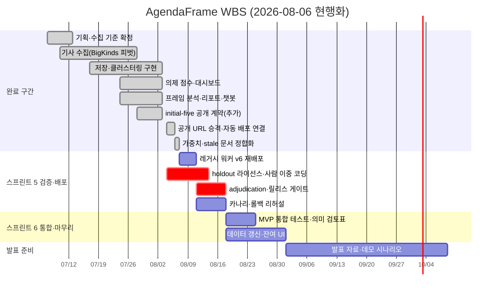

# 10. AgendaFrame WBS 및 간트차트

작성일: 2026-07-07 · 현행화: 2026-08-06
작성 담당: 강준혁
프로젝트명: AgendaFrame

## 1. 프로젝트 개요

AgendaFrame은 주요 언론사의 홈페이지 배치와 보도 빈도를 기반으로 오늘의 공적 의제를 산출하고, 동일 이슈에 대한 언론사별 관점/프레임 차이를 비교하는 AI 기반 뉴스 의제·프레임 분석 플랫폼이다.

2026-08-06 현행화 기준: 구현(2.x~5.x)은 원 계획보다 3주 이상 앞당겨 완료됐다.
수집 방식은 Playwright 상시 크롤링에서 BigKinds 메타데이터 가져오기 + 홈페이지 배치
관측으로 피벗했고, 프레임 코드북은 6종 태그에서 문제정의·원인·책임·평가·해법+취재원
구조로 교체됐다.

8월 3일 현행화 때 임계 경로로 잡았던 두 가지 중 **② 최신 빌드의 공개 URL 배포는
8월 5일에 끝났다**(라이브 14개 경로 200, `main` push 자동 배포). 배포 정합성 문서
작업(5.6)도 8월 6일에 끝났다. 남은 임계 경로는 **① 실제 사람 라벨 기반 품질 실측과
릴리스 게이트 통과** 하나다.

## 2. WBS

| WBS ID | 상위 작업 | 세부 작업 | 담당자 | 산출물 | 시작일 | 종료일 | 상태 |
| --- | --- | --- | --- | --- | --- | --- | --- |
| 1.0 | 기획 및 수집 기준 | MVP 범위와 백로그 확정 | 공동 | 수정 프로덕트 백로그 | 2026-07-07 | 2026-07-08 | 완료 |
| 1.1 | 기획 및 수집 기준 | 분석 대상 언론사 선정 | 공동 | 22개 매체 목록 | 2026-07-07 | 2026-07-09 | 완료 (3~5개 → 22개 확장) |
| 1.2 | 기획 및 수집 기준 | 정책 분야 기준과 수집 항목 정의 | 최지우 | 수집 항목 명세 | 2026-07-08 | 2026-07-11 | 완료 |
| 1.3 | 기획 및 수집 기준 | 전문 비저장·원문 링크 중심 저장 정책 | 최지우 | 공개 계약 문서·누출 테스트 | 2026-07-09 | 2026-07-12 | 완료 |
| 2.0 | 기사 수집 | 언론사별 구조·배치 기준 조사 | 강준혁 | 배치 관측 기준 | 2026-07-10 | 2026-07-14 | 완료 |
| 2.1 | 기사 수집 | 메타데이터 수집 경로 구현 | 강준혁 | BigKinds 가져오기·배치 관측 API | 2026-07-14 | 2026-07-23 | 완료 (Playwright → BigKinds 피벗) |
| 2.2 | 기사 수집 | 수집 로그·freshness 표시 | 강준혁 | `/api/health` 배지 | 2026-07-21 | 2026-07-27 | 완료 |
| 3.0 | 저장·이슈 묶기 | D1 스키마·저장 로직 | 강준혁 | 메타데이터 스키마 | 2026-07-17 | 2026-07-26 | 완료 |
| 3.1 | 저장·이슈 묶기 | 클러스터링 구현 | 강준혁 | 규칙 클러스터링 + Gemini 시맨틱 파일럿 | 2026-07-24 | 2026-08-02 | 완료 |
| 3.2 | 저장·이슈 묶기 | 클러스터링 검증 실측 | 공동 | 이중 코더 검증표 | 2026-08-04 | 2026-08-17 | **진행 예정 (스프린트 5)** — 도구는 완성, 실측 라벨 0건 |
| 4.0 | 의제 점수·대시보드 | 점수 산식·가중치 정의 | 최지우 | 산식(다양성 45·기사량 30·배치 15·후속 10) | 2026-07-24 | 2026-07-31 | 완료 |
| 4.1 | 의제 점수·대시보드 | 랭킹 API/UI | 강준혁 | 의제 랭킹 화면 | 2026-07-26 | 2026-08-01 | 완료 (라이브 확인: 7/26, 이슈 80개) |
| 4.2 | 의제 점수·대시보드 | 이슈 상세·원문 링크 | 강준혁 | 이슈 상세 화면 | 2026-07-28 | 2026-08-02 | 완료 (정렬 토글만 잔여) |
| 4.3 | 의제 점수·대시보드 | 언론사 보도량·배치 비교 | 강준혁 | 언론사 비교 화면 | 2026-07-28 | 2026-08-02 | 완료 |
| 5.0 | 프레임·AI 리포트 | 프레임 코드북·근거 정책 | 최지우 | codebook v1.0.0·근거 locator 정책 | 2026-07-24 | 2026-08-01 | 완료 (코드북 교체) |
| 5.1 | 프레임·AI 리포트 | 프레임 분석 구현 | 공동 | 규칙 엔진 + Vertex Gemini 파일럿 | 2026-07-26 | 2026-08-02 | 완료 |
| 5.2 | 프레임·AI 리포트 | 프레임 비중 그래프·근거 UI | 강준혁 | 프레임 비교 화면 | 2026-07-28 | 2026-08-02 | 완료 |
| 5.3 | 프레임·AI 리포트 | 프레임 수동 검증 실측 | 공동 | 사람 이중 코딩·adjudication 보고서 | 2026-08-04 | 2026-08-17 | **진행 예정 (스프린트 5)** — AI 코더 2인 실측(89.3%)은 완료, 사람 코더 0명 |
| 5.4 | 프레임·AI 리포트 | 리포트 구현 | 공동 | 규칙 기반 리포트·챗봇 | 2026-07-28 | 2026-08-02 | 완료 (LLM 리포트는 오프라인 경로) |
| 5.5 | 배포 정합성 | 최신 빌드 공개 URL 승격 | 강준혁 | 라이브 사이트 + initial-five 공개 | 2026-08-04 | 2026-08-05 | **완료 2026-08-05** (14개 경로 200, push 자동 배포) |
| 5.6 | 배포 정합성 | 가중치 표기·stale 문서 정합화 | 공동 | 단일 산식 문서 | 2026-08-04 | 2026-08-06 | **완료 2026-08-06** |
| 5.8 | 배포 정합성 | 레거시 워커 v6 재배포 | 강준혁 | 라이브 `/api/health` = v6 | 2026-08-07 | 2026-08-10 | 대기 |
| 5.7 | 배포 정합성 | 카나리·롤백 리허설 | 강준혁 | 리허설 기록 | 2026-08-11 | 2026-08-17 | 대기 |
| 6.0 | 검증 및 발표 준비 | 릴리스 게이트 실측 통과 | 공동 | `release_eligible: true` | 2026-08-11 | 2026-08-17 | 대기 (3.2·5.3 선행) |
| 6.1 | 검증 및 발표 준비 | MVP 최종 시나리오 테스트·의미 검토표 | 공동 | 통합 테스트·검토표 완료 기록 | 2026-08-18 | 2026-08-24 | 대기 |
| 6.2 | 검증 및 발표 준비 | 최신 기간 데이터 갱신·잔여 UI | 공동 | 발표용 최신 분석일 | 2026-08-18 | 2026-08-31 | 대기 |
| 6.3 | 검증 및 발표 준비 | 발표 자료·데모 시나리오 | 공동 | 발표 자료 | 2026-09-01 | 2026-10-08 | 대기 |

## 3. 간트차트 표

| 작업 | 7/7~7/13 | 7/14~7/20 | 7/21~7/27 | 7/28~8/3 | 8/4~8/10 | 8/11~8/17 | 8/18~8/24 | 8/25~8/31 | 9/1~10/8 |
| --- | --- | --- | --- | --- | --- | --- | --- | --- | --- |
| 범위·수집 기준 확정 | ✅ |  |  |  |  |  |  |  |  |
| 기사 수집 (BigKinds 피벗) |  | ✅ | ✅ |  |  |  |  |  |  |
| 저장 정책·DB 설계 |  | ✅ | ✅ |  |  |  |  |  |  |
| 이슈 클러스터링 |  |  | ✅ | ✅ |  |  |  |  |  |
| 의제 점수·랭킹·이슈 상세·비교 |  |  | ✅ | ✅ |  |  |  |  |  |
| 프레임 분석·리포트·챗봇 |  |  | ✅ | ✅ |  |  |  |  |  |
| 공개 URL 승격·문서 정합화 |  |  |  |  | ✅ |  |  |  |  |
| 이중 코더 라벨링·adjudication |  |  |  |  | X | X |  |  |  |
| 릴리스 게이트·카나리 리허설 |  |  |  |  |  | X |  |  |  |
| MVP 통합 테스트·의미 검토표 |  |  |  |  |  |  | X |  |  |
| 데이터 갱신·잔여 UI |  |  |  |  |  |  | X | X |  |
| 발표 자료·데모 시나리오 |  |  |  |  |  |  |  |  | X |

✅ = 완료, X = 계획

## 4. Mermaid 간트차트

