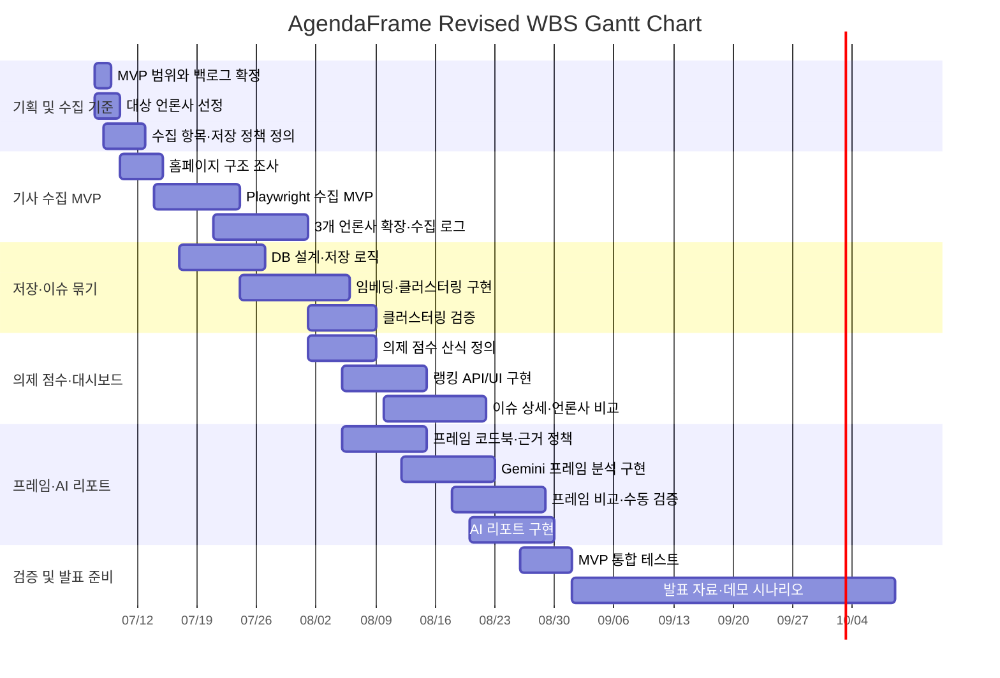

# 10. AgendaFrame WBS 및 간트차트

작성일: 2026-07-07  
작성 담당: 강준혁  
프로젝트명: AgendaFrame

## 1. 프로젝트 개요

AgendaFrame은 주요 언론사의 홈페이지 배치와 보도 빈도를 기반으로 오늘의 공적 의제를 산출하고, 동일 이슈에 대한 언론사별 관점/프레임 차이를 비교하는 AI 기반 뉴스 의제·프레임 분석 플랫폼이다.

이번 WBS는 수정 백로그의 PBL-01~PBL-20 기준에 맞춰 MVP 핵심 범위와 후순위 확장 범위를 분리했다. MVP는 기사 메타데이터 수집, 기사 전문 비저장 저장 정책, 유사 이슈 클러스터링, 의제 점수 산출, 이슈 상세·언론사 비교, 프레임 분석, AI 리포트, 검증까지를 포함한다.

## 2. WBS

| WBS ID | 상위 작업 | 세부 작업 | 담당자 | 산출물 | 시작일 | 종료일 | 기간 | 선행 작업 |
| --- | --- | --- | --- | --- | --- | --- | --- | --- |
| 1.0 | 기획 및 수집 기준 | MVP 범위와 PBL-01~20 백로그 확정 | 공동 | 수정 프로덕트 백로그 | 2026-07-07 | 2026-07-08 | 2일 | - |
| 1.1 | 기획 및 수집 기준 | 분석 대상 언론사 3~5개 선정 | 공동 | 대상 언론사 목록 | 2026-07-07 | 2026-07-09 | 3일 | 1.0 |
| 1.2 | 기획 및 수집 기준 | 정책 분야 기준과 수집 항목 정의 | 최지우 | 정책 분야·수집 항목 명세 | 2026-07-08 | 2026-07-11 | 4일 | 1.0 |
| 1.3 | 기획 및 수집 기준 | 기사 전문 비저장·원문 링크 중심 저장 정책 정리 | 최지우 | 저작권 고려 저장 정책 | 2026-07-09 | 2026-07-12 | 4일 | 1.2 |
| 2.0 | 기사 수집 MVP | 언론사별 홈페이지 구조와 주요 섹션 조사 | 강준혁 | 언론사별 구조 분석표 | 2026-07-10 | 2026-07-14 | 5일 | 1.1 |
| 2.1 | 기사 수집 MVP | Playwright 기반 기사 메타데이터 수집 MVP 구현 | 강준혁 | 수집 코드·샘플 데이터 | 2026-07-14 | 2026-07-23 | 10일 | 2.0 |
| 2.2 | 기사 수집 MVP | 3개 언론사 확장, 선택자 테스트, 수집 로그 구현 | 강준혁 | 수집 로그·갱신 시각 화면 | 2026-07-21 | 2026-07-31 | 11일 | 2.1 |
| 3.0 | 저장·이슈 묶기 | 기사·언론사·수집 로그 DB 설계 및 저장 로직 구현 | 강준혁 | 메타데이터 DB 스키마 | 2026-07-17 | 2026-07-26 | 10일 | 1.3, 2.1 |
| 3.1 | 저장·이슈 묶기 | 임베딩 기준 설계와 유사 기사 클러스터링 MVP 구현 | 강준혁 | 이슈 클러스터링 모듈 | 2026-07-24 | 2026-08-05 | 13일 | 3.0 |
| 3.2 | 저장·이슈 묶기 | 클러스터링 검증 샘플 작성 및 정합성 비교 | 공동 | 클러스터링 검증표 | 2026-08-01 | 2026-08-08 | 8일 | 3.1 |
| 4.0 | 의제 점수·대시보드 | 의제 점수 산식과 배치 위치 가중치 정의 | 최지우 | 의제 점수 산식표 | 2026-08-01 | 2026-08-08 | 8일 | 3.1 |
| 4.1 | 의제 점수·대시보드 | 의제 점수 계산 로직과 랭킹 API/UI 구현 | 강준혁 | 오늘의 의제 랭킹 화면 | 2026-08-05 | 2026-08-14 | 10일 | 4.0 |
| 4.2 | 의제 점수·대시보드 | 이슈 상세, 기사 목록, 원문 링크 이동 구현 | 강준혁 | 이슈 상세 화면 | 2026-08-10 | 2026-08-17 | 8일 | 3.1, 4.1 |
| 4.3 | 의제 점수·대시보드 | 언론사별 보도 건수와 배치 위치 비교 구현 | 강준혁 | 언론사 비교 화면 | 2026-08-14 | 2026-08-21 | 8일 | 4.2 |
| 5.0 | 프레임·AI 리포트 | 프레임 코드북과 근거 표시 정책 확정 | 최지우 | 프레임 코드북·근거 정책 | 2026-08-05 | 2026-08-14 | 10일 | 1.3 |
| 5.1 | 프레임·AI 리포트 | Gemini 프레임 분석 프롬프트/API/저장 구조 구현 | 공동 | 프레임 분석 결과 | 2026-08-12 | 2026-08-22 | 11일 | 5.0, 4.2 |
| 5.2 | 프레임·AI 리포트 | 프레임 비중 그래프와 근거 표현 UI 구현 | 강준혁 | 프레임 비교 화면 | 2026-08-18 | 2026-08-25 | 8일 | 5.1 |
| 5.3 | 프레임·AI 리포트 | 프레임 수동 검증 및 오류 유형 정리 | 공동 | 프레임 검증표 | 2026-08-22 | 2026-08-28 | 7일 | 5.1 |
| 5.4 | 프레임·AI 리포트 | AI 리포트 프롬프트/API/UI 구현 | 공동 | AI 리포트 화면 | 2026-08-20 | 2026-08-29 | 10일 | 4.1, 5.1 |
| 6.0 | 검증 및 발표 준비 | 수집부터 리포트까지 MVP 최종 시나리오 테스트 | 공동 | 통합 테스트 결과 | 2026-08-26 | 2026-08-31 | 6일 | 4.1~5.4 |
| 6.1 | 검증 및 발표 준비 | 발표 자료와 데모 시나리오 작성 | 공동 | 발표 자료·데모 시나리오 | 2026-09-01 | 2026-10-08 | 38일 | 6.0 |

## 3. 간트차트 표

| 작업 | 7/7~7/13 | 7/14~7/20 | 7/21~7/27 | 7/28~8/3 | 8/4~8/10 | 8/11~8/17 | 8/18~8/24 | 8/25~8/31 | 9/1~10/8 |
| --- | --- | --- | --- | --- | --- | --- | --- | --- | --- |
| 범위·수집 기준 확정 | X |  |  |  |  |  |  |  |  |
| 기사 수집 MVP |  | X | X |  |  |  |  |  |  |
| 저장 정책·DB 설계 |  | X | X | X |  |  |  |  |  |
| 이슈 클러스터링·초기 검증 |  |  | X | X | X |  |  |  |  |
| 의제 점수·랭킹 대시보드 |  |  |  | X | X | X |  |  |  |
| 이슈 상세·언론사 비교 |  |  |  |  | X | X | X |  |  |
| 프레임 분석·근거 표시 |  |  |  |  | X | X | X | X |  |
| AI 리포트 구현 |  |  |  |  |  | X | X | X |  |
| MVP 통합 테스트 |  |  |  |  |  |  |  | X |  |
| 발표 자료·데모 시나리오 |  |  |  |  |  |  |  |  | X |

## 4. Mermaid 간트차트

