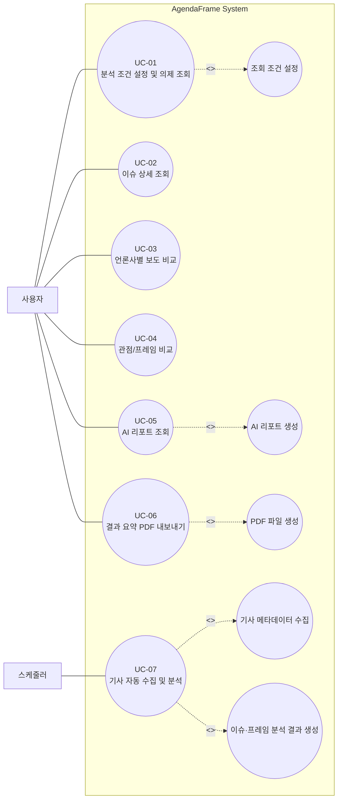
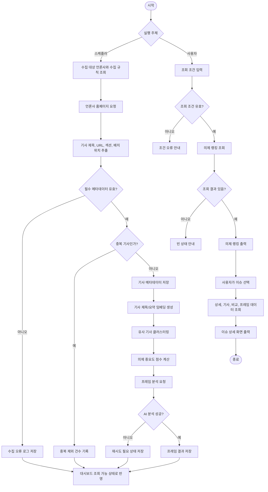
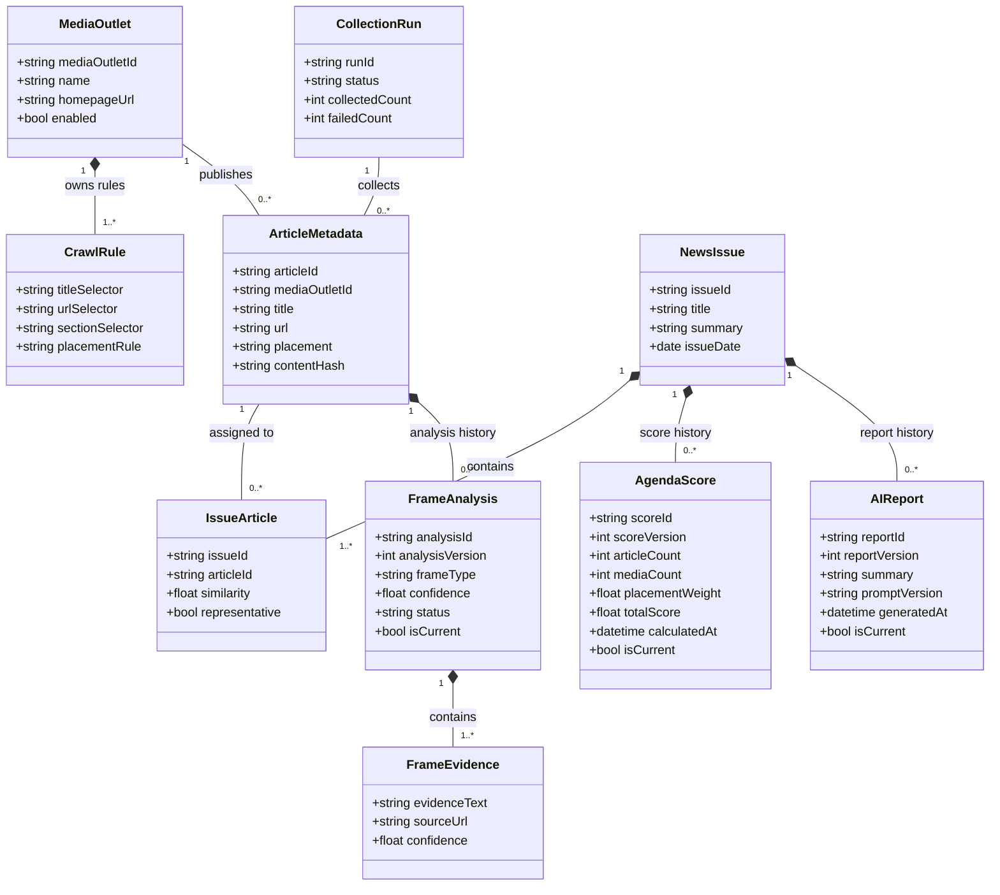
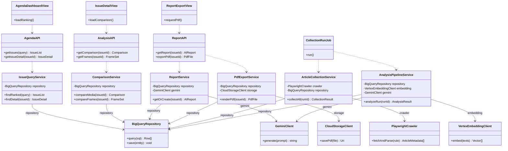
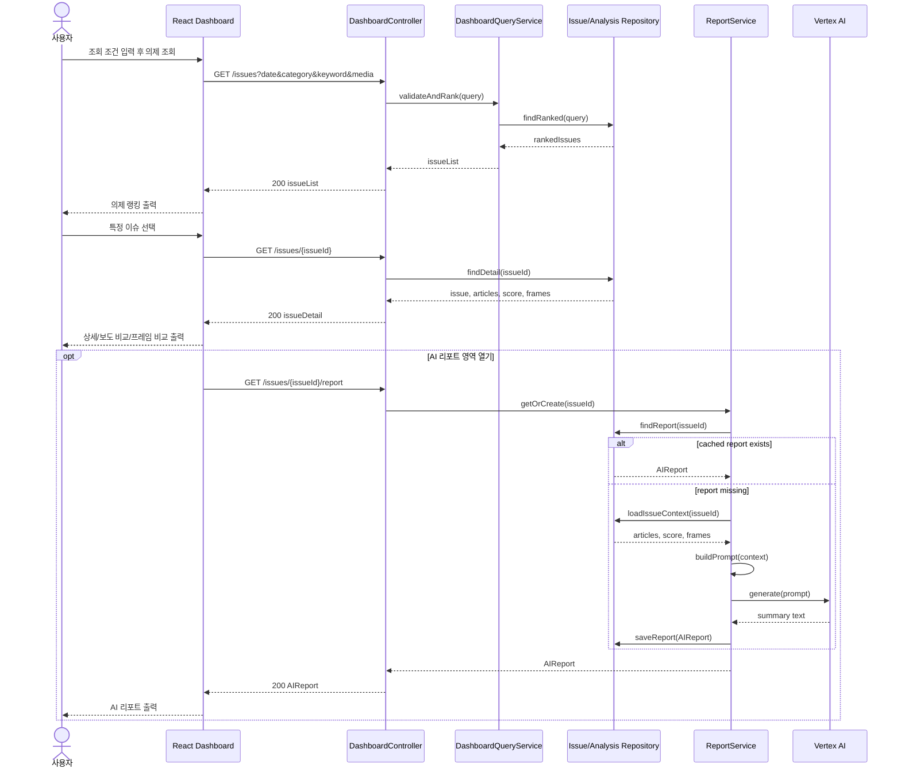
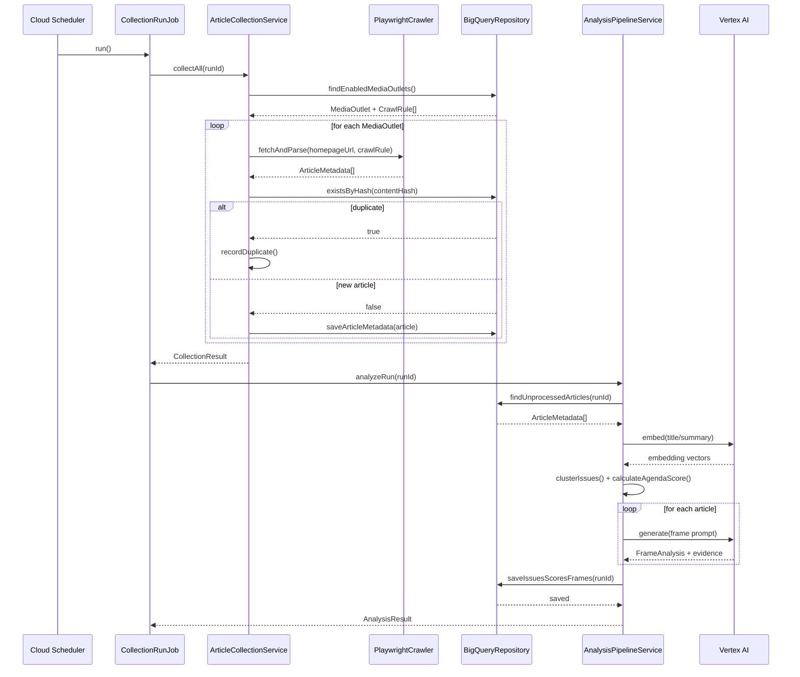

# AgendaFrame UML 산출물

작성일: 2026-07-07 · 이행 현황 갱신: 2026-08-06  
작성 담당: 강준혁  
프로젝트명: AgendaFrame

> **이 문서는 설계 단계(as-planned) 산출물이다.** 클래스·시퀀스 다이어그램은
> 2026-07-07 설계안을 보존한다. 그 뒤 구현이 세 군데에서 갈렸으므로 코드를 읽을
> 때는 아래 대응표를 함께 본다.
>
> | 다이어그램의 요소 | 구현된 것 |
> | --- | --- |
> | `PlaywrightCrawler` | 상시 크롤링 폐기. BigKinds Excel·CSV 가져오기(`site/scripts/import-bigkinds.mjs`)와 홈페이지 배치 관측 API |
> | `BigQueryRepository` | 서빙 저장소는 Cloudflare D1. BigQuery는 오프라인 분석 원장 코드로만 존재(`src/backend/gcp_store.py`) |
> | `VertexEmbeddingClient` | 임베딩 대신 제목 토큰 유사도 + 생성 모델 기반 클러스터링 |
> | `GeminiClient` | 의제 클러스터링에 사용. 프레임 분석은 오프라인 배치로 분리했고 공개 요청은 모델을 호출하지 않는다 |
> | 6종 프레임 태그 | 문제정의·원인·책임·평가·해법 + 취재원 구조(Entman 계열)로 교체. 6종은 레거시 보조 태그 |
>
> 실제 런타임 구성은 [`../architecture/cloud-runtime.md`](../architecture/cloud-runtime.md) 0장에 있다.

## 시스템 범위

AgendaFrame은 주요 언론사 홈페이지에서 기사 메타데이터를 정기 수집하고, 유사 기사를 이슈 단위로 묶은 뒤, 의제 중요도와 언론사별 보도·프레임 차이를 웹 대시보드로 제공하는 시스템이다.

시스템은 기사 전문을 저장하지 않고 제목, URL, 언론사명, 섹션, 배치 위치, 수집 시각 등 분석에 필요한 메타데이터를 중심으로 관리한다. AI는 유사 기사 묶기, 프레임 분석, 요약 리포트 생성에 사용되며, 사용자는 대시보드에서 오늘의 의제와 상세 분석 결과를 조회한다.

## 설계 기준

- 사용자 화면 기능과 백엔드 자동 분석 기능을 분리한다.
- 외부 AI와 데이터 저장소는 도메인 서비스가 직접 의존하지 않고 클라이언트/저장소 계층을 통해 호출한다.
- 조회용 API와 수집/분석 배치 작업의 책임을 분리한다.
- 유스케이스 다이어그램은 사용자 목표와 포함/확장 관계를 보여주고, 외부 시스템 상세 호출은 시퀀스 다이어그램에서 표현한다.
- 클래스 다이어그램은 실제 구현 시 필요한 엔티티, 서비스, 저장소, 외부 어댑터 경계를 나타낸다.

## 액터 정의

| 액터 | 설명 |
| --- | --- |
| 일반 사용자 | 오늘의 주요 의제, 이슈 상세, 언론사별 보도 차이, AI 리포트를 조회하는 사용자 |
| 기자/연구자 | 특정 이슈의 보도 경향과 프레임 차이를 분석 자료로 활용하는 사용자 |
| 운영자 | 분석 대상 언론사, 정책 분야, 프레임 기준, 수집 상태를 관리하는 사용자 |
| 스케줄러 | 정해진 주기에 기사 수집 및 분석 작업을 실행하는 시스템 액터 |
| 언론사 홈페이지 | 기사 제목, URL, 섹션, 배치 위치 등의 원천 데이터를 제공하는 외부 웹사이트 |
| Vertex AI | 임베딩 생성, 프레임 분석, AI 리포트 생성을 수행하는 외부 AI 서비스 |
| BigQuery | 기사 메타데이터, 이슈, 점수, 분석 결과를 저장하는 분석 데이터베이스 |
| Cloud Storage | 원본 HTML 스냅샷과 생성된 PDF 등 파일성 산출물을 저장하는 외부 저장소 |

## 유스케이스 요약

상세 명세는 `AgendaFrame_유스케이스_명세서.md`에 작성한다. 아래 표는 다이어그램과 구현 범위 추적을 위한 요약이다.

| ID | 유스케이스명 | 주요 액터 | 목적 | 세부 처리 범위 |
| --- | --- | --- | --- | --- |
| UC-01 | 분석 조건 설정 및 의제 조회 | 일반 사용자, 기자/연구자 | 조건에 맞는 오늘의 주요 의제를 순위로 확인한다. | 분석 조건 설정, 의제 랭킹 출력, 조건 초기화 |
| UC-02 | 이슈 상세 조회 | 일반 사용자, 기자/연구자 | 특정 의제의 요약, 점수 근거, 관련 기사와 원문 링크를 확인한다. | 관련 기사 조회, 원문 이동 |
| UC-03 | 언론사별 보도 비교 | 일반 사용자, 기자/연구자 | 언론사별 보도 건수, 제목 차이, 홈페이지 배치 차이를 비교한다. | 보도 건수, 제목 차이, 배치 위치를 같은 화면 흐름 안에서 처리 |
| UC-04 | 관점/프레임 비교 | 일반 사용자, 기자/연구자 | 언론사별 프레임 비중과 근거 표현을 확인한다. | 프레임 비중과 근거 문장을 같은 화면 흐름 안에서 처리 |
| UC-05 | AI 리포트 조회 | 일반 사용자, 기자/연구자, Vertex AI | 주요 관점, 부족한 관점, 치우침 가능성을 요약 리포트로 확인한다. | 저장 리포트 조회, 신규 리포트 생성 |
| UC-06 | 결과 요약 PDF 내보내기 | 일반 사용자, 기자/연구자 | 현재 조회 중인 분석 결과를 PDF 파일로 저장한다. | PDF 생성, 파일 다운로드 |
| UC-07 | 기사 자동 수집 및 분석 | 스케줄러, 운영자, 언론사 홈페이지, Vertex AI, BigQuery | 기사 메타데이터를 수집하고 이슈·점수·프레임 분석 결과를 생성한다. | 수집, 중복 제거, 클러스터링, 점수 산출, 프레임 분석 |

## 유스케이스 다이어그램

## 액티비티 다이어그램

## 클래스 다이어그램

클래스 다이어그램은 관계 의미와 구현 의존성이 섞이지 않도록 도메인 모델과 애플리케이션 구현 구조로 분리한다. 분석 결과와 AI 리포트는 재분석 이력을 보존하며 `isCurrent`로 최신본을 식별한다.

### 도메인 모델 및 데이터 관계

### 애플리케이션 구현 구조

## 시퀀스 다이어그램

### 이슈 조회 및 리포트 생성

### 기사 자동 수집 및 분석

## API 후보

| 메서드 | 경로 | 설명 | 주요 응답 |
| --- | --- | --- | --- |
| GET | `/issues` | 조건 기반 의제 랭킹 조회 | issueId, title, score, articleCount, mediaCount |
| GET | `/issues/{issueId}` | 이슈 상세 조회 | issue, articles, score, frameSummary |
| GET | `/issues/{issueId}/comparison` | 언론사별 보도 비교 조회 | mediaCount, titleList, placementSummary |
| GET | `/issues/{issueId}/frames` | 프레임 비교 조회 | frameRatio, evidenceList |
| GET | `/issues/{issueId}/report` | AI 리포트 조회 또는 생성 | summary, missingPerspective, biasPossibility |
| POST | `/issues/{issueId}/exports/pdf` | PDF 생성 요청 | downloadUrl |
| POST | `/admin/collection-runs` | 수집 작업 수동 실행 | runId, status |

## UML 산출물 요약

| 산출물 | 포함 내용 | 활용 목적 |
| --- | --- | --- |
| 유스케이스 명세서 | 주요 기능별 액터, 목표, 정상 흐름, 대안 흐름, 종료 조건 | 요구사항 검증 |
| 유스케이스 다이어그램 | 사용자 목표, 포함 기능, 선택 확장 기능 | 기능 범위와 UX 흐름 합의 |
| 액티비티 다이어그램 | 수집·분석 배치와 사용자 조회 흐름의 분기 | 처리 절차와 예외 흐름 확인 |
| 클래스 다이어그램 | 엔티티, 서비스, 저장소, 외부 클라이언트 관계 | 구현 책임과 의존성 설계 |
| 시퀀스 다이어그램 | 조회/리포트 생성, 자동 수집/분석 메시지 흐름 | API와 외부 서비스 호출 순서 검증 |
